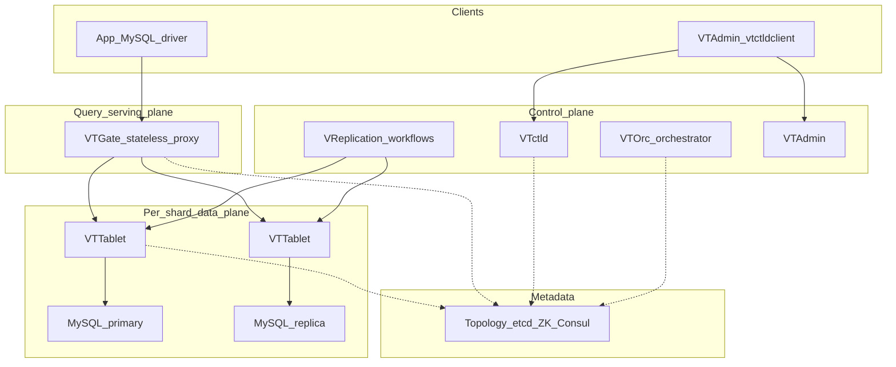
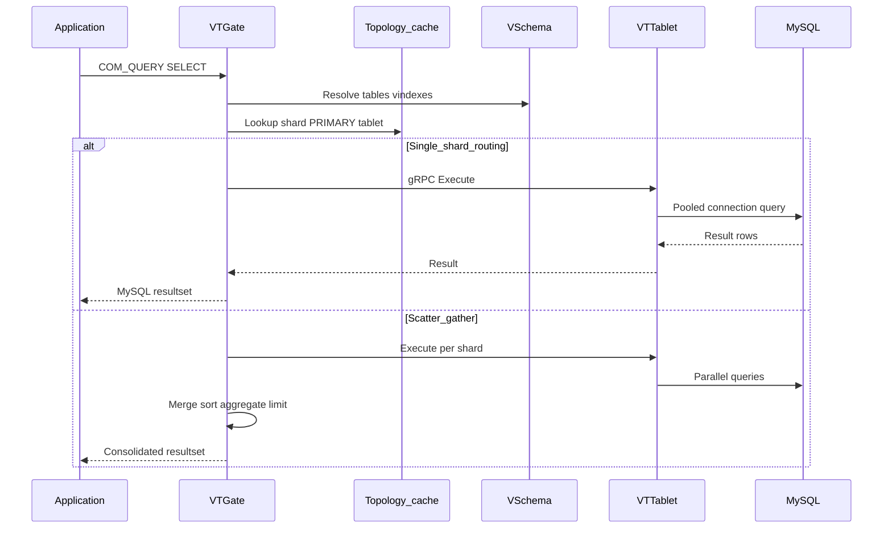
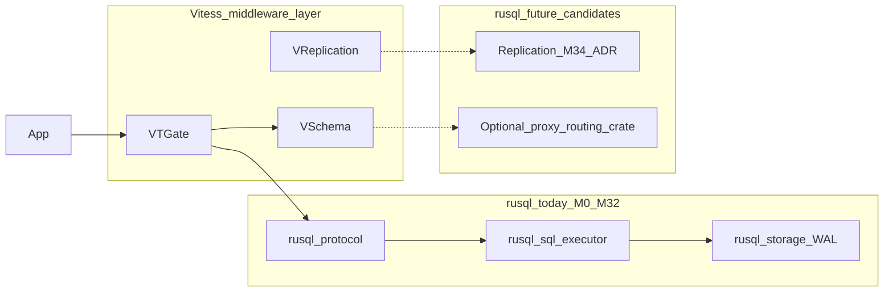

# Vitess Product Specification

**Status:** Reference document  
**Audience:** Platform engineers, DBAs, application developers, and AI agents planning rusql long-term architecture  
**Primary sources:** [Vitess v24 (stable)](https://vitess.io/docs/24.0/), [Vitess v25 (development)](https://vitess.io/docs/25.0/), [v23 release notes](https://github.com/vitessio/vitess/releases/tag/v23.0.0)

---

## Part A — Executive Summary

### Vision

**Vitess** is an open-source **MySQL clustering middleware** that lets applications treat a fleet of MySQL instances as one logical database. It preserves MySQL as the storage engine while adding a proxy layer, sharding control plane, and operational automation. Vitess is **not** a replacement database engine; it is infrastructure that makes MySQL scale horizontally and survive production failures.

Vitess was created at YouTube in 2010, served all YouTube database traffic for five+ years, graduated from the CNCF in November 2019, and is used in production by organizations including Slack, Square, and JD.com.

### Three Problems Vitess Solves

| Problem | Vitess answer |
|---------|---------------|
| **Scale beyond one server** | Horizontal sharding, connection pooling, read-replica routing |
| **Operate many MySQL instances** | Topology service, automated failover (VTOrc), backups, resharding workflows |
| **Protect the database** | Query rewriting, blocking, killing, ACLs, throttling, OLTP workload limits |

### Primary Personas

| Persona | Goal | Vitess interaction |
|---------|------|-------------------|
| **Application developer** | Use familiar MySQL drivers and SQL | Connect to VTGate; design schemas for shard-key locality |
| **DBA / platform engineer** | Operate clusters safely at scale | Configure VSchema, run MoveTables/reshard, manage Online DDL |
| **SRE** | Meet SLOs during failures and growth | Monitor VTGate/VTTablet, tune failover, manage cells and capacity |

### When to Choose Vitess

Choose Vitess when:

- You have (or will have) a **large MySQL estate** and want to preserve MySQL tooling, backup habits, and DBA skills.
- Scaling pressure is primarily about **partitioning workload across shards**, not native distributed ACID or HTAP in one system.
- Your team can invest in **VSchema design, vindexes, and resharding workflows** as data grows.
- You accept **single-shard transaction locality** as the default happy path.

Stay on vanilla MySQL when:

- A single instance (with read replicas) meets capacity for the foreseeable future.
- The team cannot absorb control-plane operational complexity.

Consider distributed SQL (e.g. TiDB, CockroachDB) when:

- You need **automatic sharding**, strong **cross-shard distributed transactions**, or integrated analytics without operating a separate middleware layer.

### Product Positioning

```
Application  →  VTGate (MySQL wire + gRPC)  →  VTTablet  →  MySQL / Percona
                      ↑
                 VSchema + Topology (etcd)
                      ↑
            Control plane (VReplication, VTOrc, VTctld, VTAdmin)
```

Vitess adds a second system on top of MySQL. The tradeoff is operational surface area in exchange for horizontal scale without rewriting application sharding logic.

---

## Part B — Product Requirements Document

### B.1 Problem and Background

YouTube's scaling path illustrates Vitess's origin:

1. **Write/read split** — primary for writes, replica for reads; replica soon overloaded.
2. **More replicas** — temporary relief; write pressure remained on primary.
3. **Application-level sharding** — shard-selection logic embedded in application code.
4. **Vitess proxy** — routing and cluster management extracted from application code.

Three recurring scaling walls map to Vitess features:

| Wall | Symptom | Vitess mitigation |
|------|---------|-------------------|
| Connections | Each MySQL connection costs 256KB–3MB RAM + CPU | VTGate lightweight connections + VTTablet pooling |
| Read throughput | Single replica cannot serve all reads | REPLICA / RDONLY tablet routing, multi-cell replicas |
| Write / data size | Primary or disk bound | Sharding, ~250GB-per-instance philosophy, resharding |

### B.2 Goals and Non-Goals

#### Goals

- Present a **unified MySQL-compatible interface** to applications (wire protocol + optional gRPC drivers).
- **Shard data horizontally** without application-side shard routing code.
- **Automate** failover, backups, topology changes, and low-downtime resharding.
- **Protect** production from expensive queries and connection storms.
- Run in **multi-cell** (multi-AZ / multi-region) topologies.
- Support **MySQL 8.0 and 8.4** (Percona Server included) as storage backends.

#### Non-Goals

- Replace MySQL as the storage engine.
- Provide **active-active multi-master** replication.
- Guarantee **strong cross-shard ACID** without performance cost (2PC is opt-in and expensive).
- Offer a fully managed zero-ops experience in the open-source project alone (hosted offerings add that layer).
- Eliminate the need for **shard-aware schema design**.

### B.3 Personas and User Journeys

#### Journey 1: Greenfield — unsharded to sharded

1. Deploy Vitess with an **unsharded keyspace** (all tables on one shard).
2. Gain connection pooling and query protection immediately.
3. Define **VSchema** with primary vindex when write scale requires sharding.
4. Run **reshard workflow** (VReplication-based) with seconds of read-only downtime.
5. Application continues using the same VTGate endpoint.

#### Journey 2: Migrate existing MySQL into Vitess

1. Stand up Vitess cluster and external MySQL source.
2. Run **MoveTables** or **Materialize** workflow (VReplication).
3. Copy from replica; stream ongoing changes.
4. **SwitchTraffic** — brief unavailability on primary tablets (seconds; worse with high replication lag).
5. Cut over application connection string to VTGate.

#### Journey 3: Online schema change

1. Developer submits `ALTER TABLE` or declarative `CREATE TABLE` target via vtgate/vtctldclient.
2. Vitess schedules managed migration (VReplication ghost-table strategy or Instant DDL where supported).
3. Operator audits progress; optional postpone cut-over until `COMPLETE`.
4. Vitess garbage-collects old table artifacts incrementally.

#### Journey 4: Primary failure

1. MySQL primary becomes unavailable.
2. **VTOrc** (or legacy orchestration) detects failure; elects new primary from replicas.
3. Topology updated in etcd; VTGate routes writes to new PRIMARY tablet.
4. Target: near-zero-downtime failover with semi-sync replication configured.

### B.4 Functional Requirements

#### FR-1: Query Serving (VTGate)

| ID | Requirement |
|----|-------------|
| FR-1.1 | Accept MySQL protocol connections from standard drivers (JDBC, Go, Python, etc.). |
| FR-1.2 | Accept gRPC connections via native Vitess drivers for optimized RPC paths. |
| FR-1.3 | Parse SQL, resolve target keyspace/shard(s) using VSchema and topology cache. |
| FR-1.4 | Route single-shard queries to one VTTablet; scatter-gather for multi-shard queries. |
| FR-1.5 | Merge ORDER BY, GROUP BY, LIMIT results in VTGate memory for sharded queries. |
| FR-1.6 | Support query deduplication (reuse in-flight identical query results). |
| FR-1.7 | Rewrite queries (e.g. inject LIMIT) per configurable rules. |
| FR-1.8 | Block or kill queries via rules and timeouts. |
| FR-1.9 | Expose session variables (e.g. `transaction_timeout` since v23). |
| FR-1.10 | Advertise MySQL version (default **8.4** in v25) to clients. |

#### FR-2: Tablet Agent (VTTablet)

| ID | Requirement |
|----|-------------|
| FR-2.1 | Run co-located with each `mysqld` instance (one tablet per MySQL). |
| FR-2.2 | Pool MySQL connections; multiplex many client sessions onto fewer DB connections. |
| FR-2.3 | Enforce query safety, backpressure, and throttling at tablet layer. |
| FR-2.4 | Report health, replication lag, and resource usage to topology. |
| FR-2.5 | Execute backups (`vtbackup`) and restores; support PITR with incremental backups. |
| FR-2.6 | Participate in VReplication as source or target. |

#### FR-3: Sharding and VSchema

| ID | Requirement |
|----|-------------|
| FR-3.1 | Support **keyspaces** (logical databases), sharded or unsharded. |
| FR-3.2 | Support **shards** with key ranges in sharded keyspaces. |
| FR-3.3 | Define **vindexes** (hash, unicode_loose_md5, lookup, custom plugins) per table. |
| FR-3.4 | Support **lookup vindexes** for queries not on shard key (unique and non-unique). |
| FR-3.5 | Provide **sequences** for global auto-increment-like IDs in sharded tables. |
| FR-3.6 | Support **vertical sharding** (MoveTables between keyspaces) and **horizontal resharding**. |
| FR-3.7 | Allow **vindex hints** in queries for explicit routing. |

#### FR-4: Consistency and Transactions

| ID | Requirement |
|----|-------------|
| FR-4.1 | Guarantee full ACID for **single-shard** transactions. |
| FR-4.2 | Support transaction modes: `SINGLE`, `MULTI` (best-effort multi-shard), `TWOPC` (distributed atomic, ~50% write overhead). |
| FR-4.3 | Route reads to PRIMARY, REPLICA, or RDONLY tablet types per session/target. |
| FR-4.4 | Optionally avoid replicas lagging beyond configured threshold. |
| FR-4.5 | Document that cross-shard reads are not guaranteed mutually consistent. |

#### FR-5: High Availability and Replication

| ID | Requirement |
|----|-------------|
| FR-5.1 | Use MySQL replication (semi-sync recommended) for durability across machines. |
| FR-5.2 | Automate primary failure detection and reparent via **VTOrc**. |
| FR-5.3 | Prefer **replace over repair** — restore from backup rather than recovering crashed MySQL. |
| FR-5.4 | Support planned reparent (successover) for maintenance. |
| FR-5.5 | Explicitly **not** support active-active multi-master. |

#### FR-6: Schema Management

| ID | Requirement |
|----|-------------|
| FR-6.1 | Provide **managed Online DDL** via VReplication (preferred production path). |
| FR-6.2 | Support declarative schema (supply target `CREATE TABLE`; Vitess computes diff). |
| FR-6.3 | Use MySQL Instant DDL when available on underlying server. |
| FR-6.4 | Allow per-shard DDL completion (`VITESS_SHARDS` syntax, v23+). |
| FR-6.5 | Track migration state; support cancel and audit across shards. |
| FR-6.6 | Auto garbage-collect migration artifacts (old ghost tables). |

#### FR-7: Data Migration (VReplication Workflows)

| ID | Requirement |
|----|-------------|
| FR-7.1 | **MoveTables** — relocate tables between keyspaces without downtime. |
| FR-7.2 | **Materialize** — replicate subset of tables to another keyspace (rollup, reference tables). |
| FR-7.3 | **Reshard** — change shard count/key ranges with VReplication. |
| FR-7.4 | Import from external MySQL 5.7–8.4, Percona, MariaDB 10.10+. |
| FR-7.5 | **VDiff** — verify source/target consistency during workflows. |

#### FR-8: Operations and Control Plane

| ID | Requirement |
|----|-------------|
| FR-8.1 | Store cluster metadata in **Topology Service** (etcd recommended; ZooKeeper, Consul supported). |
| FR-8.2 | Provide **vtctld** / **vtctldclient** for cluster administration. |
| FR-8.3 | Provide **VTAdmin** web UI for topology visualization and workflow management. |
| FR-8.4 | Organize infrastructure into **cells** (failure domains / AZs). |
| FR-8.5 | Keep topology **out of the hot query path** (cached at VTGate). |
| FR-8.6 | Support circuit breakers, connection dropping under overload. |

#### FR-9: Security

| ID | Requirement |
|----|-------------|
| FR-9.1 | Enforce **table ACLs** per connected user. |
| FR-9.2 | Support TLS for client and inter-component communication. |
| FR-9.3 | Integrate with external auth for VTGate MySQL connections (deployment-specific). |

### B.5 Non-Functional Requirements

| ID | Requirement | Notes |
|----|-------------|-------|
| NFR-1 | **Horizontal scale** of VTGate (stateless; add instances behind LB). | Large clusters may run hundreds–thousands of gates. |
| NFR-2 | **Shard size target** ~250GB per MySQL instance. | Smaller instances simplify ops; multiple instances per host OK. |
| NFR-3 | **Multi-cell resilience** — surviving single cell loss without cluster-wide outage. | Local-cell preference for reads. |
| NFR-4 | **Failover time** — seconds for VTOrc emergency reparent (deployment-dependent). | Semi-sync reduces data-loss risk. |
| NFR-5 | **Resharding downtime** — seconds of read-only for most transitions. | Not zero; plan maintenance windows. |
| NFR-6 | **MySQL compatibility** — core SQL for OLTP through VTGate; version advertised as 8.4 (v25). | See compatibility matrix. |
| NFR-7 | **Observability** — metrics, execution plans (`vtexplain`), query logging. | Integrates with Prometheus-style monitoring. |

### B.6 Architecture

#### Component Topology



#### Request Path (OLTP SELECT)



#### Key Concepts

| Concept | Definition |
|---------|------------|
| **Keyspace** | Logical database namespace; may be sharded or unsharded. |
| **Shard** | Horizontal partition of a sharded keyspace; owns a key range. |
| **Keyspace ID** | Hash/range output determining shard placement. |
| **Tablet** | `mysqld` + `vttablet` pair with a **tablet type** (PRIMARY, REPLICA, RDONLY, BATCH, …). |
| **Cell** | Group of servers in one failure domain (typically one availability zone). |
| **VSchema** | JSON/YAML schema describing vindexes, sequences, and routing for each table. |
| **Vindex** | Sharding function mapping column values to keyspace IDs; includes lookup tables. |
| **VReplication** | Binlog-based change streaming for workflows (MoveTables, Materialize, Reshard, Online DDL). |
| **VStream** | Change-stream API for consuming row changes (CDC-style). |
| **Replication graph** | Topology view of primary → replica relationships per shard. |

#### Consistency and Transaction Modes

**Read consistency levels:**

| Level | Behavior |
|-------|----------|
| REPLICA / RDONLY | Scales geographically; may be stale (replica lag). |
| PRIMARY (no txn) | Read-after-write consistent; READ_COMMITTED. |
| PRIMARY (in txn) | REPEATABLE_READ within single shard; ACID writes. |

**Transaction atomicity modes:**

| Mode | Behavior |
|------|----------|
| SINGLE | Multi-db transactions disallowed. |
| MULTI | Multi-shard best-effort; partial commit possible on failure. |
| TWOPC | Two-phase commit; distributed atomic guarantee; higher write cost. |

#### Deployment Topologies

| Topology | Use case |
|----------|----------|
| Single-cell unsharded | First adoption; pooling + protection only. |
| Multi-cell with replica-serving cells | Low-latency global reads; remote primary writes. |
| Sharded multi-cell | Full horizontal scale; primaries per shard may differ by cell. |
| Kubernetes (Vitess Operator) | Cloud-native lifecycle management. |

### B.7 MySQL Compatibility Matrix

Features below describe behavior **through VTGate** unless noted. Versions: **v23** (stable), **v24** (stable), **v25** (development).

| Feature | Status | Notes |
|---------|--------|-------|
| Standard DML (INSERT, UPDATE, DELETE) | **Supported** | Route by vindex when sharded. |
| SELECT with WHERE, JOIN, subqueries | **Supported** | Cross-shard joins work but scatter-gather is expensive. |
| CTEs (`WITH`) | **Supported** | `WITH RECURSIVE` added v23+. |
| Window functions | **Supported** | Added in recent releases (v21+). |
| Aggregations (GROUP BY, ORDER BY, LIMIT) | **Supported** | Large sharded aggregations merge in VTGate memory. |
| Prepared statements | **Supported** | COM_STMT_* through VTGate. |
| Transactions (single shard) | **Supported** | Full ACID. |
| Transactions (multi shard) | **Limited** | MULTI or TWOPC; design for single-shard writes. |
| `SELECT ... FOR UPDATE` | **Limited** | Single shard only; cross-shard not atomic. |
| Foreign keys | **Limited** | Constrained on sharded keyspaces; prefer app-level integrity. |
| Sequences / auto-increment | **Limited** | Use Vitess sequences for sharded tables; not MySQL auto_increment semantics globally. |
| Online DDL (managed) | **Supported** | Preferred path via VReplication. |
| Instant DDL | **Supported** | When underlying MySQL supports it. |
| Direct blocking `ALTER TABLE` | **Limited** | Discouraged in production; can block writes. |
| Temporary tables | **Limited** | Unsharded keyspaces only. |
| Stored procedures | **Unsupported** | Not through VTGate. |
| Triggers | **Unsupported** | Not through VTGate. |
| Events | **Unsupported** | Not through VTGate. |
| `LOCK TABLES` | **Unsupported** | Not through VTGate. |
| `GET_LOCK` / named locks | **Unsupported** | Not through VTGate. |
| `KILL` query via VTGate | **Unsupported** | Kill on underlying MySQL directly; VTGate has query timeouts. |
| Cross-shard JOIN | **Limited** | Supported but high latency; filter by vindex when possible. |
| Correlated subqueries (cross shard) | **Limited** | May fail or perform poorly; rewrite as joins. |
| `FLOAT` as PRIMARY KEY | **Discouraged** | Breaks VReplication / filtered replication correctness. |
| OLTP workload guardrails | **Supported** | Default row/time limits; switch to OLAP mode to relax. |
| Multi-query execution | **Supported** | `ExecuteMulti` / `StreamExecuteMulti` APIs (v23+). |
| Query throttler | **Experimental** | v23+ framework; API may change. |

**Storage backend versions:**

| Backend | Vitess v24 | Vitess v25 |
|---------|------------|------------|
| MySQL 8.0 | Supported (final release with 8.0 support) | Deprecated; replaced by next LTS after 8.4 |
| MySQL 8.4 | Supported | Default in `vitess/lite` image |
| Percona 8.0 / 8.4 | Supported | Supported |
| Import: MySQL 5.7–8.4, MariaDB 10.10+ | Supported | Supported |

### B.8 Operational Model

#### Tablet Types

| Type | Role |
|------|------|
| PRIMARY | Accepts writes; source of truth for shard. |
| REPLICA | Async replica; serves OLTP reads when targeted. |
| RDONLY | Serves batch/OLAP reads; not in primary failover candidate set by default. |
| BATCH | Long-running job traffic. |
| SPARE / EXPERIMENTAL | Administrative or transition states. |

#### Managed vs Unmanaged Mode

| Mode | Description |
|------|-------------|
| **Unmanaged** | Vitess provides pooling and routing; operator manages MySQL failover manually. Entry path for brownfield. |
| **Managed** | VTOrc, VReplication workflows, Online DDL, and topology automation fully engaged. Production default. |

#### Critical Workflows

| Workflow | Tool | Downtime |
|----------|------|----------|
| MoveTables | vtctldclient / VTAdmin | Near zero; brief cut-over |
| Reshard | VReplication | Seconds read-only typical |
| Online DDL | vtgate / vtctldclient | Non-blocking (VReplication strategy) |
| Emergency reparent | VTOrc | Seconds |
| Backup / PITR | vtbackup + binlog storage | No query downtime (from replica) |

### B.9 Risks and Dependencies

| Risk | Mitigation |
|------|------------|
| Topology service outage | Cached topology at VTGate; topo not in hot path; HA etcd cluster (3/5/7 nodes). |
| Poor VSchema design | Cross-shard queries dominate; expensive scatter-gather. Invest in sharding guidelines early. |
| Resharding complexity | Reversible workflows; VDiff verification; runbooks. |
| Replication lag during cut-over | MoveTables SwitchTraffic waits on lag; monitor replica delay. |
| Cross-shard transaction failures | Use SINGLE mode or design idempotent compensating logic for MULTI. |
| Operational learning curve | VTAdmin, vtctldclient, hosted offerings (e.g. PlanetScale) reduce burden. |

### B.10 Competitive Landscape

| Option | Strengths | Weaknesses vs Vitess |
|--------|-----------|---------------------|
| **Vanilla MySQL** | Simple; mature ecosystem | No native sharding; connection limits; manual failover at scale |
| **NoSQL** | Horizontal scale; flexible schema | No SQL joins/transactions; custom APIs |
| **Vitess** | Keeps MySQL; proven at YouTube scale; CNCF | Two-system ops; shard design required; cross-shard limits |
| **TiDB / distributed SQL** | Auto sharding; distributed ACID; HTAP | Not MySQL storage engine; different ops model |
| **Application sharding** | No middleware | Shard logic in every service; resharding is painful |

**Decision heuristic:** Vitess when MySQL preservation and team MySQL expertise matter more than native distributed transactions in one product.

---

## Part C — Agent-Oriented Appendix

### C.1 Capability Acceptance Checklist

Each item is objectively verifiable in a Vitess cluster (local `vttestserver` or staging).

- [ ] **CAP-01:** Application connects to VTGate with a standard MySQL driver without Vitess-specific client code.
- [ ] **CAP-02:** `SHOW VITESS_SHARDS` (or vtctldclient equivalent) lists all shards for a sharded keyspace.
- [ ] **CAP-03:** `SELECT` with equality predicate on primary vindex column generates a single-shard execution plan (verify via `vtexplain`).
- [ ] **CAP-04:** `SELECT` without vindex predicate on a sharded table generates multi-shard scatter plan.
- [ ] **CAP-05:** INSERT into sharded table with sequence-backed column auto-allocates ID from sequence table.
- [ ] **CAP-06:** BEGIN … COMMIT touching one shard succeeds with ACID semantics (read same row after commit).
- [ ] **CAP-07:** MULTI-shard transaction rolls back failed shard statement without leaving committed partial state on failed shard.
- [ ] **CAP-08:** Query with no LIMIT on OLTP workload is rewritten or rejected per workload rules.
- [ ] **CAP-09:** Table ACL denies SELECT for unauthorized MySQL user with explicit error.
- [ ] **CAP-10:** VTGate pools 1000+ lightweight connections without 1000+ MySQL connections on backend.
- [ ] **CAP-11:** MoveTables workflow reaches `SwitchTraffic` with VDiff reporting zero mismatches.
- [ ] **CAP-12:** Managed Online DDL completes without blocking writes on primary for full table copy duration.
- [ ] **CAP-13:** Simulated primary failure triggers VTOrc reparent; writes succeed on new PRIMARY within 60s.
- [ ] **CAP-14:** REPLICA-targeted read returns data when replica is caught up; fails over to PRIMARY when replica lag exceeds threshold (if configured).
- [ ] **CAP-15:** Reshard workflow doubles shard count; row count per keyspace matches pre-reshard totals (VDiff).
- [ ] **CAP-16:** `WITH RECURSIVE` CTE returns correct hierarchical result through VTGate (v23+).
- [ ] **CAP-17:** `CREATE PROCEDURE` through VTGate is rejected (unsupported).
- [ ] **CAP-18:** Topology change (tablet addition) propagates to VTGate within watch interval without restart.
- [ ] **CAP-19:** `vtbackup` produces restorable backup; restored tablet catches up via replication.
- [ ] **CAP-20:** Cross-shard JOIN returns correct result set but execution plan shows multiple shard routes (latency acceptable only for analytics).

### C.2 Negative Constraints (Must Not Assume)

Agents and integrators **must not** assume:

1. Cross-shard transactions are fully ACID by default (only TWOPC provides distributed atomicity).
2. Any SQL valid in standalone MySQL works through VTGate (procedures, triggers, locks do not).
3. MySQL `AUTO_INCREMENT` provides global uniqueness on sharded tables without Vitess sequences.
4. Foreign keys enforce referential integrity across shards.
5. Active-active writes to multiple primaries are supported.
6. Topology service is queried on every SQL statement (routing uses cache).
7. Resharding is always zero-downtime (seconds of read-only are normal).
8. Temporary tables work in sharded keyspaces.
9. `KILL QUERY` through VTGate stops a running query (use MySQL directly or timeouts).
10. Vitess removes the need for capacity planning (~250GB/shard guidance still applies).

### C.3 Verification Scenarios

#### Scenario VS-01: Unsharded bootstrap

1. Deploy single keyspace, single shard, PRIMARY + REPLICA.
2. Create table; INSERT 1000 rows; SELECT COUNT(*) via VTGate.
3. **Pass:** Count = 1000; execution plan shows single shard.

#### Scenario VS-02: Sharded routing

1. Define hash vindex on `user_id`; shard keyspace into 4 shards.
2. Insert rows with known `user_id` values; SELECT with `user_id = ?`.
3. **Pass:** `vtexplain` shows exactly one shard; correct row returned.

#### Scenario VS-03: MoveTables cutover

1. Create source unsharded keyspace with table `orders`.
2. Start MoveTables to target sharded keyspace.
3. Run workload during copy; VDiff after sync.
4. SwitchTraffic; compare row counts and checksum sample.
5. **Pass:** Zero VDiff mismatches; application reads/writes via new keyspace.

#### Scenario VS-04: Primary failover

1. Identify PRIMARY tablet; stop MySQL process.
2. Wait for VTOrc detection.
3. Issue INSERT via VTGate.
4. **Pass:** INSERT succeeds; topology shows new PRIMARY; no acknowledged write lost (semi-sync on).

#### Scenario VS-05: Online DDL

1. Submit `ALTER TABLE ... ADD COLUMN` via managed migration.
2. Run concurrent INSERT/UPDATE workload.
3. **Pass:** Migration completes; writes not blocked for full copy window; new column visible.

#### Scenario VS-06: Cross-shard transaction failure (MULTI mode)

1. Begin transaction; UPDATE shard A; UPDATE shard B (force B to fail, e.g. constraint).
2. **Pass:** Shard A changes rolled back; no partial commit visible to other sessions.

### C.4 Open Questions and Version Drift

| Topic | Status | Action |
|-------|--------|--------|
| MySQL 8.0 support sunset | v24 last with 8.0; v25 targets 8.4+ | Pin storage version in deployment docs |
| Query Throttler | Experimental v23+ | Do not build production SLOs on API until stable |
| Cross-shard atomic transactions | Improvements tracked in Vitess issues | Re-check release notes per upgrade |
| MySQL 9.x LTS | Planned for v25+ | Monitor Vitess supported-databases page |

---

## Part D — rusql Long-Term Implications

This section maps Vitess product capabilities to [rusql architecture](../architecture/overview.md) and [ADR: Replication](../specs/adr-replication.md). It informs future milestones; it does **not** authorize immediate implementation.

### D.1 Layer Mapping

rusql today implements the **MySQL engine layer** that Vitess wraps with VTTablet. Vitess's VTGate, VSchema, and control plane sit **above** rusql's protocol/server stack.



### D.2 Component-by-Component Stance

| Vitess component | rusql relevance | Suggested stance |
|------------------|-----------------|------------------|
| **VTGate / query routing** | Not in scope until single-node MySQL compat is credible | Defer until post-M30 compat baseline; prefer **integrate upstream Vitess** over reimplementing VTGate |
| **VSchema / sharding** | Requires distributed catalog + metadata | Defer; document shard-key design guidelines when SQL surface matures |
| **VTTablet** | rusql **is** the MySQL instance Vitess manages | **Strategic fit:** rusql as Vitess storage backend if wire + SQL + replication reach MySQL semantics |
| **VReplication / VStream** | Consumes binlog-like change stream | M34+ replication ADR should note event format compatibility for external capture |
| **Topology (etcd)** | External to database engine | Out of scope for rusql core; required only if operating as Vitess backend |
| **VTOrc / failover** | Cluster orchestration | Do not build; use Vitess control plane |
| **Online DDL / MoveTables** | Depends on multi-instance + change stream | Post-replication; integrate via Vitess rather than rebuild |
| **Query rewriting / ACL** | Could live in `rusql-server` eventually | Low priority vs [mysql-compat-roadmap](../specs/mysql-compat-roadmap.md) |

### D.3 Proposed rusql Phasing

| Phase | Scope | Vitess relationship |
|-------|-------|---------------------|
| **Phase 1 (current)** | Single-node MySQL 8.0 wire + SQL subset (M0–M32+) | None; establish engine credibility |
| **Phase 2** | Durable replication stream (M34+ per ADR) | Enable change capture patterns VReplication expects |
| **Phase 3** | Multi-instance read replicas (primary/replica ADR) | rusql instances could join a replication graph under Vitess |
| **Phase 4 (optional)** | Sharding proxy or Vitess integration | **Evaluate:** run rusql behind VTTablet vs build `rusql-proxy` |
| **Explicit non-goals (near term)** | Full VReplication, VTOrc, etcd topology | Too large; **integrate, don't reimplement** |

### D.4 rusql Non-Goals (Vitess-Informed)

- Reimplement VTGate, VSchema parser, or topology service in Rust for MVP clustering.
- Promise Vitess compatibility before MySQL 8.0 client compatibility is proven (mysql-test subset, mysql-diff).
- Target active-active multi-master (aligned with Vitess philosophy).
- Block single-node roadmap on distributed features.

### D.5 Future ADR Triggers

Create a new ADR when:

1. **M34 replication** ships — decide binlog vs WAL exposure for external consumers (Vitess, CDC).
2. **First multi-instance milestone** — decide rusql-as-Vitess-backend vs standalone cluster.
3. **Compat threshold reached** (M30+ stable) — evaluate official Vitess integration test matrix against rusql.

---

## References

| Resource | URL |
|----------|-----|
| What Is Vitess | https://vitess.io/docs/25.0/overview/whatisvitess/ |
| Architecture | https://vitess.io/docs/25.0/overview/architecture/ |
| Scalability Philosophy | https://vitess.io/docs/25.0/overview/scalability-philosophy/ |
| Supported Databases | https://vitess.io/docs/25.0/overview/supported-databases/ |
| VSchema Guide | https://vitess.io/docs/25.0/user-guides/vschema-guide/ |
| Schema Changes | https://vitess.io/docs/25.0/user-guides/schema-changes/ |
| Migration (MoveTables) | https://vitess.io/docs/25.0/user-guides/migration/ |
| MoveTables Concept | https://vitess.io/docs/25.0/concepts/move-tables/ |
| VTGate Reference | https://vitess.io/docs/24.0/reference/programs/vtgate/ |
| Cross-shard JOIN FAQ | https://vitess.io/docs/faq/sharding/advanced/can-i-use-vitess-to-do-cross-shard-joins-or/ |
| Vitess GitHub | https://github.com/vitessio/vitess |
| rusql MySQL compat roadmap | [mysql-compat-roadmap.md](../specs/mysql-compat-roadmap.md) |
| rusql replication ADR | [adr-replication.md](../specs/adr-replication.md) |

---

## Document History

| Date | Change |
|------|--------|
| 2026-07-07 | Initial reference spec (Parts A–D) for rusql architecture planning |
