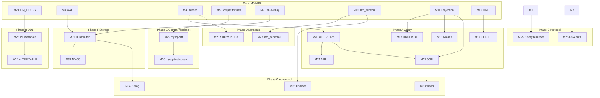

# MySQL 8.0 Compatibility Roadmap

**Goal**: A credible MySQL 8.0 wire + SQL subset for real clients (ORMs, `mysql` CLI, drivers), developed via Harness Engineering.

**Current**: M0–M16 merged on `main` (~5–10% of full MySQL surface).

**Strategy**: Vertical slices per milestone → one issue → one PR. Dependencies enforced in issue bodies; only `agent-ready` issues are picked by the agent loop.

---

## Dependency graph (high level)

---

## Phase A — SQL query surface

| ID | Title | Depends on | Priority |
|----|-------|------------|----------|
| M17 | ORDER BY single column | M14 | P0 |
| M18 | SELECT column aliases (`AS`) | M14 | P0 |
| M19 | LIMIT OFFSET | M16 | P1 |
| M20 | WHERE comparisons and AND | M4 | P0 |
| M21 | IS NULL / IS NOT NULL | M20 | P1 |
| M22 | INNER JOIN two tables | M14, M20 | P0 |

## Phase B — DDL & constraints

| ID | Title | Depends on | Priority |
|----|-------|------------|----------|
| M23 | PRIMARY KEY / NOT NULL metadata | M2 | P1 |
| M24 | ALTER TABLE ADD COLUMN | M23 | P1 |

## Phase C — Wire protocol

| ID | Title | Depends on | Priority |
|----|-------|------------|----------|
| M25 | Binary resultset (COM_STMT) | M11 | P1 |
| M26 | caching_sha2 RSA full auth | M7 | P2 |

## Phase D — Information schema

| ID | Title | Depends on | Priority |
|----|-------|------------|----------|
| M27 | information_schema.schemata/statistics | M12 | P1 |
| M28 | SHOW INDEX | M4, M12 | P1 |

## Phase E — Differential compat

| ID | Title | Depends on | Priority |
|----|-------|------------|----------|
| M29 | mysql-diff Docker runner | M5 | P0 |
| M30 | mysql-test subset port | M29 | P2 |

## Phase F — Transactions & durability

| ID | Title | Depends on | Priority |
|----|-------|------------|----------|
| M31 | COMMIT flushes WAL | M3, M9 | P0 |
| M32 | MVCC snapshot isolation | M31 | P2 |

## Phase G — Advanced

| ID | Title | Depends on | Priority |
|----|-------|------------|----------|
| M33 | SQL views (read-only) | M22 | P2 |
| M34 | Binlog replication (ADR) | M31, ADR #5 | P3 |
| M35 | utf8mb4 charset metadata | M12 | P2 |

## Book (parallel)

| ID | Title | Notes |
|----|-------|-------|
| #28 | Professional depth pass | Not blocking code milestones |

---

## Agent loop rules

1. Only issues labeled `agent-ready` are picked.
2. Respect **Depends on** — do not start blocked milestones.
3. After roadmap issue creation, **M17** is first `agent-ready` code issue.
4. Book #28 is `agent-ready` for documentation passes between code milestones.

## Est. compatibility depth

| After phase | Approx. MySQL surface |
|-------------|----------------------|
| M16 (now) | ~8% |
| Phase A | ~15% |
| Phase D | ~20% |
| Phase E | measurable gap vs MySQL |
| Phase F | production-shaped durability |
