# MySQL 8.0 Full Parity Roadmap (M36+)

**North star**: Functional equivalence with MySQL 8.0 for wire protocol, SQL, metadata, security, replication, and observable behavior — validated by an expanding `mysql-test` corpus and industry benchmarks.

**Baseline (2026-08-11)**: M0–M35 merged; third-party CLI smoke 11/11; `mysql-diff` 15/15; estimated ~15–20% MySQL surface. See [performance benchmark](../reports/performance-benchmark-2026-08-11.md).

**Current comparison (2026-09-20)**: [rusql vs MySQL test report](../reports/rusql-vs-mysql.md) — `mysql-diff` 297/297; not a production drop-in.

**Prior roadmap (M0–M35)**: [mysql-compat-roadmap.md](mysql-compat-roadmap.md)

---

## Strategy

1. **Category-vertical slices** — one GitHub issue per gap category (M36–M61), each with testable acceptance criteria.
2. **Compat feedback loop** — every milestone extends `mysql-diff` and/or `mysql-test` subset before merge.
3. **Performance in parallel** — PERF-B* issues track benchmark harness + hot-path optimization against the 2026-08-11 baseline.
4. **Agent loop** — label `agent-ready` only when dependencies are merged and file boundaries are clear.

---

## Dependency overview

```mermaid
flowchart TB
  subgraph done [Done M0-M35]
    M31[M31 WAL]
    M32[M32 MVCC]
    M33[M33 Views]
    M34[M34 Binlog spike]
    M35[M35 Charset meta]
  end

  subgraph phaseH [Phase H DDL]
    M36[M36 CREATE DATABASE]
    M37[M37 AUTO_INCREMENT]
    M38[M38 ALTER extended]
    M39[M39 FOREIGN KEY]
    M40[M40 Data types]
  end

  subgraph phaseI [Phase I Query SQL]
    M41[M41 OUTER JOIN]
    M42[M42 Subqueries]
    M43[M43 GROUP BY]
    M44[M44 UNION]
    M45[M45 WHERE extended]
    M46[M46 Functions]
  end

  subgraph phaseJ [Phase J Programs]
    M47[M47 Procedures]
    M48[M48 Triggers]
  end

  subgraph phaseK [Phase K Optimizer]
    M49[M49 Cost planner]
    M50[M50 Composite idx]
  end

  subgraph phaseL [Phase L Protocol]
    M51[M51 CHANGE_USER]
    M52[M52 FIELD_LIST STMT]
    M53[M53 PROCESSLIST]
  end

  subgraph phaseM [Phase M Security]
    M54[M54 GRANT REVOKE]
    M55[M55 Multi-user auth]
  end

  subgraph phaseN [Phase N Replication]
    M56[M56 Binlog prod]
    M57[M57 Replica]
    M58[M58 GTID]
  end

  subgraph phaseO [Phase O Charset]
    M59[M59 Collation]
  end

  subgraph phaseP [Phase P Harness]
    M60[M60 mysql-test++]
    M61[M61 Sysbench schema]
  end

  M31 --> M36
  M36 --> M37
  M23 --> M38
  M38 --> M39
  M2 --> M40
  M22 --> M41
  M20 --> M45
  M45 --> M42
  M14 --> M43
  M43 --> M46
  M46 --> M47
  M47 --> M48
  M4 --> M49
  M49 --> M50
  M7 --> M51
  M11 --> M52
  M1 --> M53
  M36 --> M54
  M7 --> M55
  M34 --> M56
  M56 --> M57
  M57 --> M58
  M35 --> M59
  M29 --> M60
  M40 --> M61
```

---

## Phase H — DDL & catalog

| ID | Title | Priority | Issue |
|----|-------|----------|-------|
| M36 | CREATE/DROP DATABASE + multi-schema catalog | P1 | [#100](https://github.com/tanbamboo/rusql/issues/100) |
| M37 | AUTO_INCREMENT columns | P1 | [#101](https://github.com/tanbamboo/rusql/issues/101) |
| M38 | ALTER TABLE extended (DROP/MODIFY/RENAME) | P1 | [#102](https://github.com/tanbamboo/rusql/issues/102) |
| M39 | FOREIGN KEY constraints | P2 | [#103](https://github.com/tanbamboo/rusql/issues/103) |
| M40 | Extended data types (DECIMAL, DATETIME, TEXT/BLOB, JSON) | P1 | [#104](https://github.com/tanbamboo/rusql/issues/104) |

**Exit criteria**: ORMs can run `CREATE DATABASE`, migrate with common ALTER patterns, and use AUTO_INCREMENT primary keys.

---

## Phase I — SQL query surface

| ID | Title | Priority | Issue |
|----|-------|----------|-------|
| M41 | LEFT/RIGHT OUTER JOIN | P1 | [#105](https://github.com/tanbamboo/rusql/issues/105) |
| M42 | Subqueries (IN, EXISTS, derived tables) | P1 | [#106](https://github.com/tanbamboo/rusql/issues/106) |
| M43 | GROUP BY, HAVING, aggregate functions | P1 | [#107](https://github.com/tanbamboo/rusql/issues/107) |
| M44 | UNION / UNION ALL | P2 | [#108](https://github.com/tanbamboo/rusql/issues/108) |
| M45 | Extended WHERE (OR, NOT, LIKE, BETWEEN, IN lists) | P0 | [#109](https://github.com/tanbamboo/rusql/issues/109) |
| M46 | SQL expressions and built-in functions | P1 | [#110](https://github.com/tanbamboo/rusql/issues/110) |

**Exit criteria**: Typical ORM-generated SELECT/INSERT/UPDATE passes portable `mysql-diff` suites.

---

## Phase J — Stored programs

| ID | Title | Priority | Issue |
|----|-------|----------|-------|
| M47 | Stored procedures and functions | P3 | [#111](https://github.com/tanbamboo/rusql/issues/111) |
| M48 | Triggers (BEFORE/AFTER INSERT/UPDATE/DELETE) | P3 | [#112](https://github.com/tanbamboo/rusql/issues/112) |

**Exit criteria**: `mysql-test` `sp-*` and `trigger-*` subsets begin passing (initial 10-case tranche).

---

## Phase K — Query optimizer

| ID | Title | Priority | Issue |
|----|-------|----------|-------|
| M49 | Cost-based planner and index selection | P2 | [#113](https://github.com/tanbamboo/rusql/issues/113) |
| M50 | Composite and covering indexes | P2 | [#114](https://github.com/tanbamboo/rusql/issues/114) |

**Exit criteria**: `EXPLAIN` output shape; index chosen for range and composite predicates; no full-table scan when index exists.

---

## Phase L — Wire protocol

| ID | Title | Priority | Issue |
|----|-------|----------|-------|
| M51 | COM_CHANGE_USER + COM_RESET_CONNECTION | P2 | [#115](https://github.com/tanbamboo/rusql/issues/115) |
| M52 | COM_FIELD_LIST + COM_STMT_RESET / long data | P2 | [#116](https://github.com/tanbamboo/rusql/issues/116) |
| M53 | COM_PROCESS_INFO + SHOW PROCESSLIST | P2 | [#117](https://github.com/tanbamboo/rusql/issues/117) |

**Exit criteria**: Official `mysql` client and JDBC drivers connect without protocol errors for admin/diagnostic commands.

---

## Phase M — Security & privileges

| ID | Title | Priority | Issue |
|----|-------|----------|-------|
| M54 | GRANT/REVOKE privilege model | P2 | [#118](https://github.com/tanbamboo/rusql/issues/118) |
| M55-auth | Multi-user accounts + mysql_native_password | P2 | [#119](https://github.com/tanbamboo/rusql/issues/119) |

**Exit criteria**: Least-privilege app user; root vs app separation in compat tests.

---

## Phase N — Replication

| ID | Title | Priority | Issue |
|----|-------|----------|-------|
| M56 | Production binlog event stream | P3 | [#120](https://github.com/tanbamboo/rusql/issues/120) |
| M57 | Replica applier + COM_BINLOG_DUMP | P3 | [#121](https://github.com/tanbamboo/rusql/issues/121) |
| M58 | GTID sets and failover semantics | P3 | [#122](https://github.com/tanbamboo/rusql/issues/122) |

**Exit criteria**: Primary → replica row-level consistency for DML subset; ADR updated.

---

## Phase O — Charset & collation

| ID | Title | Priority | Issue |
|----|-------|----------|-------|
| M59 | Full utf8mb4 collation (compare/sort) | P2 | [#123](https://github.com/tanbamboo/rusql/issues/123) |

**Exit criteria**: `ORDER BY` on utf8mb4 strings matches MySQL for `utf8mb4_unicode_ci` / `utf8mb4_0900_ai_ci` sample corpus.

---

## Phase P — Compat harness expansion

| ID | Title | Priority | Issue |
|----|-------|----------|-------|
| M60 | mysql-test subset expansion (100+ portable cases) | P1 | [#124](https://github.com/tanbamboo/rusql/issues/124) |
| M61 | Sysbench-compatible OLTP schema | P2 | [#125](https://github.com/tanbamboo/rusql/issues/125) |

**Exit criteria**: CI tracks compat %; Sysbench `oltp_point_select` runnable against rusql.

---

## Phase Q — Post-parity client SQL (M62+)

M36–M61 + PERF-B* landed. Remaining work focuses on high-ROI client/ORM gaps.

| ID | Title | Priority | Issue |
|----|-------|----------|-------|
| M62 | `utf8mb4_0900_ai_ci` collation | P2 | [#153](https://github.com/tanbamboo/rusql/issues/153) |
| M65 | `DATABASE`/`USER`/`VERSION` session info functions | P1 | [#163](https://github.com/tanbamboo/rusql/issues/163) |
| M66 | `CASE` / `IF` expressions | P1 | [#165](https://github.com/tanbamboo/rusql/issues/165) |
| M67 | `SELECT DISTINCT` | P1 | [#167](https://github.com/tanbamboo/rusql/issues/167) |
| M68 | `INSERT … SELECT` / `ON DUPLICATE KEY UPDATE` | P1 | [#169](https://github.com/tanbamboo/rusql/issues/169) |
| M69 | Non-recursive `WITH` (CTE) | P1 | [#171](https://github.com/tanbamboo/rusql/issues/171) |
| M70 | Window ranking (`ROW_NUMBER` / `RANK` / `DENSE_RANK`) | P1 | [#173](https://github.com/tanbamboo/rusql/issues/173) |
| M71 | Per-event `COM_BINLOG_DUMP` | P1 | [#175](https://github.com/tanbamboo/rusql/issues/175) |
| M72 | `TABLE_MAP` + `WRITE_ROWS` for INSERT | P1 | [#177](https://github.com/tanbamboo/rusql/issues/177) |
| M73 | Live `COM_BINLOG_DUMP` follow | P1 | [#179](https://github.com/tanbamboo/rusql/issues/179) |
| M74 | `UPDATE_ROWS` / `DELETE_ROWS` | P1 | [#181](https://github.com/tanbamboo/rusql/issues/181) |
| M75 | `LAST_INSERT_ID()` | P1 | [#183](https://github.com/tanbamboo/rusql/issues/183) |
| M76 | `CONNECTION_ID()` / `ROW_COUNT()` | P1 | [#185](https://github.com/tanbamboo/rusql/issues/185) |
| M77 | `@@` session/system variables | P1 | [#187](https://github.com/tanbamboo/rusql/issues/187) |
| M78 | `FOUND_ROWS()` / `SQL_CALC_FOUND_ROWS` | P1 | [#189](https://github.com/tanbamboo/rusql/issues/189) |
| M79 | More `@@` stubs for connector handshake probes | P1 | [#191](https://github.com/tanbamboo/rusql/issues/191) |
| M80 | `SHOW VARIABLES` stub catalog | P1 | [#193](https://github.com/tanbamboo/rusql/issues/193) |
| M81 | `SET @@` / session variable persistence | P1 | [#195](https://github.com/tanbamboo/rusql/issues/195) |
| M82 | `SET NAMES` / user variables `@foo` | P1 | [#197](https://github.com/tanbamboo/rusql/issues/197) |
| M83 | `SET CHARACTER SET` / `SELECT @foo := expr` | P1 | [#199](https://github.com/tanbamboo/rusql/issues/199) |
| M84 | `SET TRANSACTION ISOLATION LEVEL` | P1 | [#201](https://github.com/tanbamboo/rusql/issues/201) |
| M85 | `SELECT … FOR UPDATE` probe/no-op | P1 | [#203](https://github.com/tanbamboo/rusql/issues/203) |
| M86 | `SHOW STATUS` stubs | P1 | [#205](https://github.com/tanbamboo/rusql/issues/205) |
| M87 | `SHOW TABLE STATUS` stubs | P1 | [#207](https://github.com/tanbamboo/rusql/issues/207) |
| M88 | `SHOW ENGINES` stubs | P1 | [#209](https://github.com/tanbamboo/rusql/issues/209) |
| M89 | `SHOW CHARACTER SET` stubs | P1 | [#211](https://github.com/tanbamboo/rusql/issues/211) |
| M90 | `SHOW WARNINGS` stubs | P1 | [#213](https://github.com/tanbamboo/rusql/issues/213) |
| M91 | `SHOW CREATE DATABASE` stubs | P1 | [#215](https://github.com/tanbamboo/rusql/issues/215) |
| M92 | `SHOW CREATE VIEW` stubs | P1 | [#217](https://github.com/tanbamboo/rusql/issues/217) |
| M93 | `SHOW TRIGGERS` stubs | P1 | [#219](https://github.com/tanbamboo/rusql/issues/219) |
| M94 | `SHOW CREATE TRIGGER` stubs | P1 | [#221](https://github.com/tanbamboo/rusql/issues/221) |
| M95 | `SHOW CREATE PROCEDURE` stubs | P1 | [#223](https://github.com/tanbamboo/rusql/issues/223) |
| M96 | `SHOW CREATE FUNCTION` stubs | P1 | [#225](https://github.com/tanbamboo/rusql/issues/225) |
| M97 | `SHOW PROCEDURE STATUS` stubs | P1 | [#227](https://github.com/tanbamboo/rusql/issues/227) |
| M98 | `SHOW FUNCTION STATUS` stubs | P1 | [#229](https://github.com/tanbamboo/rusql/issues/229) |
| M99 | `SHOW CREATE USER` stubs | P1 | [#232](https://github.com/tanbamboo/rusql/issues/232) |
| M100 | `SHOW CREATE EVENT` stubs | P1 | [#234](https://github.com/tanbamboo/rusql/issues/234) |
| M101 | `SHOW EVENTS` stubs | P1 | [#236](https://github.com/tanbamboo/rusql/issues/236) |
| M102 | `CREATE EVENT` catalog | P1 | [#238](https://github.com/tanbamboo/rusql/issues/238) |
| M103 | `ALTER EVENT` catalog | P1 | [#240](https://github.com/tanbamboo/rusql/issues/240) |
| M104 | Event scheduler executes due `AT` events | P1 | [#242](https://github.com/tanbamboo/rusql/issues/242) |
| M105 | Event scheduler executes `EVERY` interval | P1 | [#244](https://github.com/tanbamboo/rusql/issues/244) |
| M106 | Event scheduler `STARTS` / `ENDS` | P1 | [#246](https://github.com/tanbamboo/rusql/issues/246) |
| M107 | Event `DEFINER` / `ON COMPLETION` | P1 | [#248](https://github.com/tanbamboo/rusql/issues/248) |
| M108 | Event `COMMENT` persistence | P1 | [#250](https://github.com/tanbamboo/rusql/issues/250) |
| M109 | `information_schema.EVENTS` | P1 | [#251](https://github.com/tanbamboo/rusql/issues/251) |
| M110 | `TRUNCATE TABLE` | P1 | [#252](https://github.com/tanbamboo/rusql/issues/252) |
| M111 | `REPLACE INTO` | P1 | [#253](https://github.com/tanbamboo/rusql/issues/253) |
| M112 | `INSERT IGNORE` | P1 | [#254](https://github.com/tanbamboo/rusql/issues/254) |
| M113 | `SUBSTRING` / `ROUND` / `DATE_ADD` | P1 | [#255](https://github.com/tanbamboo/rusql/issues/255) |

**Status (2026-09-20)**: Filed table M62–M113 is complete on `main` (last: M113 [PR #263](https://github.com/tanbamboo/rusql/pull/263)). **Exit criteria met**: official MySQL CLI session introspection (`DATABASE`/`USER`/`VERSION`/`CONNECTION_ID`/`@@`/`SHOW VARIABLES`/`SET NAMES`) returns no `unsupported function`.

---

## Phase R — Post-Q high-ROI client SQL (M114–M132)

Gap probe after M113: 29 probes, **19 rusql gaps** (plus `CREATE PROCEDURE … IN` both-fail). Each row is one small shippable issue. Specs: `.github/issue-bodies/issue-m114-*.md` … `issue-m132-*.md`. Recreate: `node scripts/create-phase-r-issues.mjs`.

**First `agent-ready`**: M114 (`CREATE DATABASE … CHARACTER SET`). Later issues get `agent-ready` only after dependencies on `main` and file-boundary conflicts are clear.

| ID | Title | Priority | Issue |
|----|-------|----------|-------|
| M114 | `CREATE DATABASE … CHARACTER SET` / `COLLATE` | P0 | [#265](https://github.com/tanbamboo/rusql/issues/265) |
| M115 | `JSON_EXTRACT` (`$.key`) | P1 | [#266](https://github.com/tanbamboo/rusql/issues/266) |
| M116 | `UUID()` | P1 | [#267](https://github.com/tanbamboo/rusql/issues/267) |
| M117 | `LAST_INSERT_ID(expr)` setter | P1 | [#268](https://github.com/tanbamboo/rusql/issues/268) |
| M118 | `GET_LOCK` / `RELEASE_LOCK` | P1 | [#269](https://github.com/tanbamboo/rusql/issues/269) |
| M119 | `information_schema.TABLE_CONSTRAINTS` | P1 | [#270](https://github.com/tanbamboo/rusql/issues/270) |
| M120 | `information_schema.PROCESSLIST` | P1 | [#271](https://github.com/tanbamboo/rusql/issues/271) |
| M121 | `information_schema.PARAMETERS` | P2 | [#272](https://github.com/tanbamboo/rusql/issues/272) |
| M122 | `SHOW BINARY LOGS` | P1 | [#273](https://github.com/tanbamboo/rusql/issues/273) |
| M123 | `SHOW BINLOG EVENTS` | P1 | [#274](https://github.com/tanbamboo/rusql/issues/274) |
| M124 | `CREATE OR REPLACE VIEW` | P1 | [#275](https://github.com/tanbamboo/rusql/issues/275) |
| M125 | Text `PREPARE` / `EXECUTE` / `DEALLOCATE PREPARE` | P1 | [#276](https://github.com/tanbamboo/rusql/issues/276) |
| M126 | `SAVEPOINT` / `ROLLBACK TO` / `RELEASE` | P1 | [#277](https://github.com/tanbamboo/rusql/issues/277) |
| M127 | `WITH RECURSIVE` | P1 | [#278](https://github.com/tanbamboo/rusql/issues/278) |
| M128 | `INTERSECT` | P2 | [#279](https://github.com/tanbamboo/rusql/issues/279) |
| M129 | Window `ROWS BETWEEN` frames | P2 | [#280](https://github.com/tanbamboo/rusql/issues/280) |
| M130 | `CREATE EVENT … DISABLE ON SLAVE` | P2 | [#281](https://github.com/tanbamboo/rusql/issues/281) |
| M131 | `SHOW ENGINE INNODB STATUS` stub | P2 | [#282](https://github.com/tanbamboo/rusql/issues/282) |
| M132 | Procedure `IN` parameters | P2 | [#283](https://github.com/tanbamboo/rusql/issues/283) |

**Exit criteria**: Gap probe post-M113 set is 0 rusql-only failures (or documented both-fail). `mysql-diff` extended per issue. Still **not** full MySQL 8.0 (see Phases S–Z).

---

## Phase S — JSON, set SQL, and remaining query forms (M133–M145)

Filed: GitHub milestone [Phase S](https://github.com/tanbamboo/rusql/milestone/10), issues [#285](https://github.com/tanbamboo/rusql/issues/285)–[#297](https://github.com/tanbamboo/rusql/issues/297). Specs: `.github/issue-bodies/issue-m133-*.md`–`issue-m145-*.md`. Recreate: `node scripts/create-phase-s-z-issues.mjs`. **Not `agent-ready`** until Phase R M115/M127/M128/M129 are on `main`.

| ID | Title | Priority | Issue | Acceptance (summary) | File boundaries (summary) |
|----|-------|----------|-------|----------------------|---------------------------|
| M133 | `JSON_UNQUOTE` / `->` / `->>` | P1 | [#285](https://github.com/tanbamboo/rusql/issues/285) | `col->'$.a'` and `JSON_UNQUOTE(JSON_EXTRACT(…))` match portable `mysql-diff` | `rusql-sql`, `rusql-executor` expr |
| M134 | `JSON_OBJECT` / `JSON_ARRAY` / `JSON_SET` | P1 | [#286](https://github.com/tanbamboo/rusql/issues/286) | Construct/update JSON; unknown paths documented | `rusql-executor` expr |
| M135 | `LAG` / `LEAD` / `SUM() OVER` | P1 | [#287](https://github.com/tanbamboo/rusql/issues/287) | One-arg offset default 1; no frames unless M129 landed | `rusql-executor` window |
| M136 | `EXCEPT` / `EXCEPT ALL` | P2 | [#288](https://github.com/tanbamboo/rusql/issues/288) | Same column count/types as `UNION` | `rusql-executor` set ops |
| M137 | `FULL OUTER JOIN` | P2 | [#289](https://github.com/tanbamboo/rusql/issues/289) | NULL-pad both sides; `mysql-diff` | `rusql-executor` join |
| M138 | `VALUES` row constructor | P2 | [#290](https://github.com/tanbamboo/rusql/issues/290) | `SELECT * FROM (VALUES (1),(2)) t(n)` or MySQL `VALUES ROW(1)` | `rusql-sql`, executor |
| M139 | `CAST` / `CONVERT` charset | P2 | [#291](https://github.com/tanbamboo/rusql/issues/291) | `CONVERT(s USING utf8mb4)` | executor expr |
| M140 | Date pack (`DATE_SUB`, `DATEDIFF`, `DATE_FORMAT`) | P1 | [#292](https://github.com/tanbamboo/rusql/issues/292) | Portable subset vs Docker MySQL | executor expr |
| M141 | String pack (`TRIM`, `REPLACE`, `SUBSTRING_INDEX`) | P1 | [#293](https://github.com/tanbamboo/rusql/issues/293) | Portable subset | executor expr |
| M142 | `GREATEST` / `LEAST` | P2 | [#294](https://github.com/tanbamboo/rusql/issues/294) | Two-or-more args | executor expr |
| M143 | `INSERT … SET` | P2 | [#295](https://github.com/tanbamboo/rusql/issues/295) | Same as column-list INSERT | executor insert |
| M144 | Multi-table `UPDATE`/`DELETE` | P2 | [#296](https://github.com/tanbamboo/rusql/issues/296) | Two-table INNER JOIN form | executor DML |
| M145 | `EXPLAIN FORMAT=JSON` stub | P3 | [#297](https://github.com/tanbamboo/rusql/issues/297) | Accepted; documented subset | planner / executor |

**Exit criteria**: Common ORM SELECT/JSON and reporting SQL in the portable corpus match MySQL; remaining misses are typed (GIS/fulltext), not `unsupported function` for this pack.

---

## Phase T — Schema completeness (M146–M156)

Filed: milestone [Phase T](https://github.com/tanbamboo/rusql/milestone/11), issues [#298](https://github.com/tanbamboo/rusql/issues/298)–[#308](https://github.com/tanbamboo/rusql/issues/308). **Not `agent-ready`** (depends on Phase R / schema catalog).

| ID | Title | Priority | Issue | Acceptance (summary) | File boundaries (summary) |
|----|-------|----------|-------|----------------------|---------------------------|
| M146 | Generated columns (`AS (expr)` VIRTUAL) | P1 | [#298](https://github.com/tanbamboo/rusql/issues/298) | Stored in catalog; SELECT computes; no STORED yet | core catalog, executor, storage meta |
| M147 | `CHECK` constraints | P1 | [#299](https://github.com/tanbamboo/rusql/issues/299) | CREATE TABLE CHECK; INSERT/UPDATE reject errno 3819 | executor, catalog |
| M148 | `ENUM` / `SET` types | P2 | [#300](https://github.com/tanbamboo/rusql/issues/300) | Store as string; invalid value sql_mode documented | types, executor |
| M149 | `DEFAULT` expressions (`DEFAULT (expr)`) | P1 | [#301](https://github.com/tanbamboo/rusql/issues/301) | INSERT omit-col uses default | catalog, insert |
| M150 | Invisible columns / indexes | P3 | [#302](https://github.com/tanbamboo/rusql/issues/302) | `INVISIBLE` omitted from `SELECT *` | catalog, SELECT * |
| M151 | Functional indexes | P3 | [#303](https://github.com/tanbamboo/rusql/issues/303) | Index on `(expr)` point lookup | storage, planner |
| M152 | Table partitioning (RANGE HASH KEY LIST) MVP | P2 | [#304](https://github.com/tanbamboo/rusql/issues/304) | CREATE + prune equality on RANGE | storage (new module), ADR |
| M153 | `ALTER TABLE … ADD/DROP INDEX` | P1 | [#305](https://github.com/tanbamboo/rusql/issues/305) | Already partial; close remaining ALTER forms used by dumps | executor alter |
| M154 | `CREATE TABLE … LIKE` / `AS SELECT` | P1 | [#306](https://github.com/tanbamboo/rusql/issues/306) | Copy schema; CTAS inserts rows | executor DDL |
| M155 | `RENAME TABLE` multi-pair | P2 | [#307](https://github.com/tanbamboo/rusql/issues/307) | Atomic swap of two names | storage |
| M156 | `information_schema.COLUMNS` extras (`COLUMN_DEFAULT`, `EXTRA`, `COLUMN_KEY`) | P1 | [#308](https://github.com/tanbamboo/rusql/issues/308) | ORM migrators | info_schema |

**Exit criteria**: `mysqldump` of a **simple** InnoDB schema (no GIS/partition/generated STORED) loads with errors only on documented skips.

---

## Phase U — Transactions, locking, isolation (M157–M164)

Trust: isolation/locking that changes engine semantics is **L1 stop** if it becomes a new lock manager — keep slices small; ADR required before gap locks.

Filed: milestone [Phase U](https://github.com/tanbamboo/rusql/milestone/12), issues [#309](https://github.com/tanbamboo/rusql/issues/309)–[#316](https://github.com/tanbamboo/rusql/issues/316). **Not `agent-ready`**.

| ID | Title | Priority | Issue | Acceptance (summary) | File boundaries (summary) |
|----|-------|----------|-------|----------------------|---------------------------|
| M157 | `SELECT … FOR UPDATE` waits (same-row writers) | P0 | [#309](https://github.com/tanbamboo/rusql/issues/309) | Second connection blocks or times out; not a no-op | storage txn, server |
| M158 | Isolation `READ COMMITTED` vs snapshot | P1 | [#310](https://github.com/tanbamboo/rusql/issues/310) | `SET TRANSACTION` changes what a second stmt sees | storage MVCC |
| M159 | `SERIALIZABLE` = `FOR UPDATE` on reads (documented) | P2 | [#311](https://github.com/tanbamboo/rusql/issues/311) | Or reject with documented errno | storage |
| M160 | Deadlock detection / errno 1213 | P2 | [#312](https://github.com/tanbamboo/rusql/issues/312) | Cycle abort one waiter | txn |
| M161 | Gap / next-key locks (InnoDB RR) | P3 | [#313](https://github.com/tanbamboo/rusql/issues/313) | ADR; phantom prevention on tested range | storage |
| M162 | XA (`XA START`/`END`/`PREPARE`/`COMMIT`) | P3 | [#314](https://github.com/tanbamboo/rusql/issues/314) | Two-phase; persist prepare | storage, protocol |
| M163 | `LOCK TABLES` / `UNLOCK TABLES` | P2 | [#315](https://github.com/tanbamboo/rusql/issues/315) | Session table locks | executor, session |
| M164 | `GET_LOCK` timeout wait (if M118 was non-blocking only) | P2 | [#316](https://github.com/tanbamboo/rusql/issues/316) | `timeout>0` waits | executor, session |

**Exit criteria**: Concurrent `FOR UPDATE` + UPDATE test vs MySQL matches wait/error class; isolation is no longer “overlay only.”

---

## Phase V — Stored programs (M165–M172)

Filed: milestone [Phase V](https://github.com/tanbamboo/rusql/milestone/13), issues [#317](https://github.com/tanbamboo/rusql/issues/317)–[#324](https://github.com/tanbamboo/rusql/issues/324). **Not `agent-ready`**.

| ID | Title | Priority | Issue | Acceptance (summary) | File boundaries (summary) |
|----|-------|----------|-------|----------------------|---------------------------|
| M165 | `OUT` / `INOUT` procedure params | P2 | [#317](https://github.com/tanbamboo/rusql/issues/317) | `CALL` assigns user vars | sql stored_programs, executor |
| M166 | `SIGNAL` / `RESIGNAL` | P2 | [#318](https://github.com/tanbamboo/rusql/issues/318) | errno + SQLSTATE to client | executor programs |
| M167 | `DECLARE` variables in BEGIN…END | P1 | [#319](https://github.com/tanbamboo/rusql/issues/319) | Procedure-local vars | programs |
| M168 | `IF` / `WHILE` / `LOOP` / `LEAVE` | P1 | [#320](https://github.com/tanbamboo/rusql/issues/320) | Control flow in procedures | programs |
| M169 | Cursors (`DECLARE CURSOR` / `FETCH`) | P2 | [#321](https://github.com/tanbamboo/rusql/issues/321) | One open cursor per CALL | programs |
| M170 | Condition `HANDLER` | P3 | [#322](https://github.com/tanbamboo/rusql/issues/322) | CONTINUE/EXIT | programs |
| M171 | Trigger timings completeness (BEFORE UPDATE/DELETE, AFTER INSERT) | P1 | [#323](https://github.com/tanbamboo/rusql/issues/323) | All 6 MySQL timings | programs |
| M172 | `DELIMITER` in COM_QUERY (or documented mysql CLI limitation) | P2 | [#324](https://github.com/tanbamboo/rusql/issues/324) | Multi-stmt CREATE PROCEDURE from official CLI | server, sql |

**Exit criteria**: `mysql-test` `sp-*` / `trigger-*` first 10 portable cases pass or are listed in SKIPS with reason.

---

## Phase W — Replication production (M173–M180)

Filed: milestone [Phase W](https://github.com/tanbamboo/rusql/milestone/14), issues [#325](https://github.com/tanbamboo/rusql/issues/325)–[#332](https://github.com/tanbamboo/rusql/issues/332). **Not `agent-ready`**.

| ID | Title | Priority | Issue | Acceptance (summary) | File boundaries (summary) |
|----|-------|----------|-------|----------------------|---------------------------|
| M173 | GTID event type 33 | P1 | [#325](https://github.com/tanbamboo/rusql/issues/325) | Replica applies Gtid_log_event | binlog, replica |
| M174 | Heartbeat events | P2 | [#326](https://github.com/tanbamboo/rusql/issues/326) | Dump connection stays alive | protocol dump |
| M175 | `SHOW MASTER STATUS` / `SHOW BINARY LOG STATUS` live | P1 | [#327](https://github.com/tanbamboo/rusql/issues/327) | File + position from WAL/binlog | executor SHOW |
| M176 | GTID executed set (`@@gtid_executed`) | P1 | [#328](https://github.com/tanbamboo/rusql/issues/328) | Persist + handshake | session, replica |
| M177 | Failover semantics (promote replica) | P2 | [#329](https://github.com/tanbamboo/rusql/issues/329) | ADR; documented subset | replica |
| M178 | Semi-sync ACK stub or reject | P3 | [#330](https://github.com/tanbamboo/rusql/issues/330) | Do not silently ignore | protocol |
| M179 | `CHANGE MASTER TO` / `START SLAVE` | P2 | [#331](https://github.com/tanbamboo/rusql/issues/331) | Persist replica config | replica |
| M180 | Row event v2 / partial images | P3 | [#332](https://github.com/tanbamboo/rusql/issues/332) | Matches mysqlbinlog for UPDATE | binlog |

**Exit criteria**: Primary → replica row consistency for the DML subset; GTID failover documented (not Group Replication).

---

## Phase X — Security and TLS (M181–M188)

Trust: **must not** autonomously change auth/TLS model without human review — issues stay `needs-human` until an ADR is accepted. Filed: milestone [Phase X](https://github.com/tanbamboo/rusql/milestone/15), issues [#333](https://github.com/tanbamboo/rusql/issues/333)–[#340](https://github.com/tanbamboo/rusql/issues/340). **Not `agent-ready`**.

| ID | Title | Priority | Issue | Acceptance (summary) | File boundaries (summary) |
|----|-------|----------|-------|----------------------|---------------------------|
| M181 | TLS `--ssl-cert` / `--ssl-key` | P1 | [#333](https://github.com/tanbamboo/rusql/issues/333) | Official client `--ssl-mode=REQUIRED` | server, protocol |
| M182 | Roles (`CREATE ROLE` / `GRANT role`) | P2 | [#334](https://github.com/tanbamboo/rusql/issues/334) | Privilege via role graph | privileges |
| M183 | Password policy / `caching_sha2` expire | P3 | [#335](https://github.com/tanbamboo/rusql/issues/335) | Documented subset | auth |
| M184 | `REQUIRE SSL` per account | P2 | [#336](https://github.com/tanbamboo/rusql/issues/336) | Depends M181 | accounts |
| M185 | Audit log (connect + query JSON) | P3 | [#337](https://github.com/tanbamboo/rusql/issues/337) | Optional file | server |
| M186 | `mysql.user` table shape closer to 8.0 | P2 | [#338](https://github.com/tanbamboo/rusql/issues/338) | Connector probes | info_schema / mysql schema |
| M187 | `FLUSH PRIVILEGES` | P2 | [#339](https://github.com/tanbamboo/rusql/issues/339) | Reload `mysql.user.json` | privileges |
| M188 | Enterprise plugins — **out of scope** (document skip) | P3 | [#340](https://github.com/tanbamboo/rusql/issues/340) | SKIPS + report | docs only |

---

## Phase Y — Observability (M189–M195)

Filed: milestone [Phase Y](https://github.com/tanbamboo/rusql/milestone/16), issues [#341](https://github.com/tanbamboo/rusql/issues/341)–[#345](https://github.com/tanbamboo/rusql/issues/345), [#347](https://github.com/tanbamboo/rusql/issues/347), [#348](https://github.com/tanbamboo/rusql/issues/348) (GitHub #346 is the merged M114 PR, not a Phase Y issue). **Not `agent-ready`**.

| ID | Title | Priority | Issue | Acceptance (summary) | File boundaries (summary) |
|----|-------|----------|-------|----------------------|---------------------------|
| M189 | `performance_schema` stub schema (connect, statements_digest) | P2 | [#341](https://github.com/tanbamboo/rusql/issues/341) | Not errno 1146; documented counters | info_schema |
| M190 | Live `SHOW STATUS` (Questions, Uptime, Threads) | P1 | [#342](https://github.com/tanbamboo/rusql/issues/342) | Replace constants where cheap | session, SHOW STATUS |
| M191 | Slow query log | P2 | [#343](https://github.com/tanbamboo/rusql/issues/343) | Threshold + file | server |
| M192 | General log optional | P3 | [#344](https://github.com/tanbamboo/rusql/issues/344) | File | server |
| M193 | `SHOW ENGINE INNODB STATUS` live mutex/lock section (after M131 stub) | P3 | [#345](https://github.com/tanbamboo/rusql/issues/345) | Best-effort rusql txn snapshot | executor |
| M194 | `information_schema.INNODB_*` stubs | P3 | [#347](https://github.com/tanbamboo/rusql/issues/347) | Not 1146 | info_schema |
| M195 | Error log `--log-error` | P2 | [#348](https://github.com/tanbamboo/rusql/issues/348) | tracing to file | server |

---

## Phase Z — Remaining MySQL 8.0 surface (M196–M210)

These are required for the **ultimate** goal. They are not “won’t do”; they are last because they need ADRs and/or large engines. Full 100% Oracle-plugin parity may still exclude closed-source enterprise plugins (document as out of scope with a skip list, not as silent success).

Filed: milestone [Phase Z](https://github.com/tanbamboo/rusql/milestone/17), issues [#349](https://github.com/tanbamboo/rusql/issues/349)–[#363](https://github.com/tanbamboo/rusql/issues/363). **Not `agent-ready`**. M209/M210 are the definition of done; the ultimate MySQL 8.0 goal is **not** complete until their evidence is on `main`.

| ID | Title | Priority | Issue | Notes |
|----|-------|----------|-------|-------|
| M196 | GIS / spatial types + `ST_*` | P3 | [#349](https://github.com/tanbamboo/rusql/issues/349) | Separate crate only with ADR |
| M197 | FULLTEXT indexes | P3 | [#350](https://github.com/tanbamboo/rusql/issues/350) | |
| M198 | InnoDB tablespaces / crash recovery equivalent | P2 | [#351](https://github.com/tanbamboo/rusql/issues/351) | ADR; not heap+WAL alone |
| M199 | Group Replication / InnoDB Cluster | P3 | [#352](https://github.com/tanbamboo/rusql/issues/352) | After W |
| M200 | Clone plugin | P3 | [#353](https://github.com/tanbamboo/rusql/issues/353) | |
| M201 | UDF `.so` | P3 | [#354](https://github.com/tanbamboo/rusql/issues/354) | Likely skip; document |
| M202 | Component / plugin loader | P3 | [#355](https://github.com/tanbamboo/rusql/issues/355) | |
| M203 | Window named frames + `RANGE BETWEEN` | P2 | [#356](https://github.com/tanbamboo/rusql/issues/356) | After M129 |
| M204 | Histogram / optimizer stats persist | P2 | [#357](https://github.com/tanbamboo/rusql/issues/357) | |
| M205 | Hash join / block nested loop cost | P2 | [#358](https://github.com/tanbamboo/rusql/issues/358) | planner |
| M206 | Temp tables (`MEMORY`/`InnoDB` engine clause honored) | P2 | [#359](https://github.com/tanbamboo/rusql/issues/359) | |
| M207 | `mysql-test` portable expansion 100 → 500 | P1 | [#360](https://github.com/tanbamboo/rusql/issues/360) | harness |
| M208 | Gap probe promoted to CI floor (0 unexpected gaps) | P1 | [#361](https://github.com/tanbamboo/rusql/issues/361) | harness |
| M209 | Requirement-by-requirement MySQL 8.0 matrix in `rusql-vs-mysql.md` | P0 | [#362](https://github.com/tanbamboo/rusql/issues/362) | docs + tests; **definition of done for the ultimate goal** |
| M210 | Production drop-in gate (dump/restore + ORM suite + replication + locking) | P0 | [#363](https://github.com/tanbamboo/rusql/issues/363) | All prior exits green |

**Ultimate-goal exit (all must be proven, not estimated):**

1. Requirement matrix in [rusql-vs-mysql.md](../reports/rusql-vs-mysql.md) has no “Missing” rows for MySQL 8.0 community server client-visible SQL/protocol/replication/security listed in this document.
2. `mysql-diff` + gap probe + expanded `mysql-test` subset + locking/replication suites are green vs Docker `mysql:8.0`.
3. Documented **out of scope** items (enterprise plugins, closed-source) are listed explicitly and not counted as parity.
4. HANDOFF may say “ultimate goal achieved” **only** after M209+M210 evidence.

Until then the goal is **not** complete.

---

## Performance track (PERF-B*)

Baseline: [performance-benchmark-2026-08-11.md](../reports/performance-benchmark-2026-08-11.md)

| ID | Title | Priority | Baseline gap | Issue |
|----|-------|----------|--------------|-------|
| PERF-B1 | Persistent-connection benchmark harness | P1 | Remove CLI spawn noise | [#126](https://github.com/tanbamboo/rusql/issues/126) |
| PERF-B2 | Scan + ORDER BY + LIMIT optimization | P1 | rusql 0.74× MySQL QPS | [#127](https://github.com/tanbamboo/rusql/issues/127) |
| PERF-B3 | Primary-key UPDATE path optimization | P1 | rusql 0.62× MySQL QPS | [#128](https://github.com/tanbamboo/rusql/issues/128) |
| PERF-B4 | Multi-threaded benchmark (1/4/8/16 clients) | P2 | Concurrency unknown | [#129](https://github.com/tanbamboo/rusql/issues/129) |
| PERF-B5 | WAL fsync policy vs throughput tuning | P2 | Durability/latency trade-off | [#130](https://github.com/tanbamboo/rusql/issues/130) |
| PERF-B6 | Sysbench `oltp_point_select` CI gate | P2 | Industry standard OLTP read | [#131](https://github.com/tanbamboo/rusql/issues/131) |

**Target (stretch)**: Within 10% of MySQL 8.0 on PERF-B1 harness for point/index read, scan+sort, PK update at 100k rows single-thread persistent connection.

---

## Compatibility depth estimate

| After phase | Approx. MySQL surface |
|-------------|----------------------|
| M35 | ~15–20% |
| Phase H + I (M40, M45) | ~35% |
| Phase K + P (M50, M60) | ~45% |
| Phase Q complete (M113) | ~45–70% client-visible (stubs inflate this) |
| Phase R (M132) | High-ROI probe gaps closed; still not drop-in |
| Phases S–U | Typical ORM + locking path |
| Phases V–Y | Programs, replication, security, ops |
| Phase Z + M209/M210 | **Only then** claim MySQL 8.0 functional equivalence |

Full 100% parity with Oracle MySQL (every edge case, every engine, every plugin) remains a multi-year program; this roadmap is the complete constitution-aligned plan to that goal. Enterprise-only plugins are listed as explicit skips, not silent success.

User-facing snapshot of what that estimate means in practice: [rusql vs MySQL test report](../reports/rusql-vs-mysql.md).

---

## Issue index

Canonical issues **#100–#131** (created 2026-08-11). First `agent-ready` parity issue: [#109 M45](https://github.com/tanbamboo/rusql/issues/109).

> **Note**: An earlier partial batch created duplicate issues #90–#99; close those in favor of #100–#109.

Recreate idempotently:

- M36–M61 + PERF-B*: `node scripts/create-parity-issues.mjs`
- Phase R M114–M132: `node scripts/create-phase-r-issues.mjs`
- Phase S–Z M133–M210: `node scripts/create-phase-s-z-issues.mjs`

Issue bodies live in `.github/issue-bodies/`. GitHub milestones: **Phase R** (#9, issues #265–#283), **Phase S** (#10, #285–#297), **Phase T** (#11, #298–#308), **Phase U** (#12, #309–#316), **Phase V** (#13, #317–#324), **Phase W** (#14, #325–#332), **Phase X** (#15, #333–#340), **Phase Y** (#16, #341–#345/#347/#348), **Phase Z** (#17, #349–#363). Do not mark `agent-ready` until dependencies are on `main` and file boundaries do not overlap in-flight work. Phase X stays `needs-human` until an ADR is accepted. Ultimate MySQL 8.0 goal is **not** complete until M209+M210.
