# MySQL 8.0 Full Parity Roadmap (M36+)

**North star**: Functional equivalence with MySQL 8.0 for wire protocol, SQL, metadata, security, replication, and observable behavior — validated by an expanding `mysql-test` corpus and industry benchmarks.

**Baseline (2026-08-11)**: M0–M35 merged; third-party CLI smoke 11/11; `mysql-diff` 15/15; estimated ~15–20% MySQL surface. See [performance benchmark](../reports/performance-benchmark-2026-08-11.md).

**Prior roadmap (M0–M35)**: [mysql-compat-roadmap.md](mysql-compat-roadmap.md)

---

## Strategy

1. **Category-vertical slices** — one GitHub issue per gap category (M36–M61), each with testable acceptance criteria.
2. **Compat feedback loop** — every milestone extends `mysql-diff` and/or `mysql-test` subset before merge.
3. **Performance in parallel** — PERF-B* issues track benchmark harness + hot-path optimization against the 2026-08-11 baseline.
4. **Agent loop** — label `agent-ready` only when dependencies are merged and file boundaries are clear.

---

## Dependency overview

```mermaid
flowchart TB
  subgraph done [Done M0-M35]
    M31[M31 WAL]
    M32[M32 MVCC]
    M33[M33 Views]
    M34[M34 Binlog spike]
    M35[M35 Charset meta]
  end

  subgraph phaseH [Phase H DDL]
    M36[M36 CREATE DATABASE]
    M37[M37 AUTO_INCREMENT]
    M38[M38 ALTER extended]
    M39[M39 FOREIGN KEY]
    M40[M40 Data types]
  end

  subgraph phaseI [Phase I Query SQL]
    M41[M41 OUTER JOIN]
    M42[M42 Subqueries]
    M43[M43 GROUP BY]
    M44[M44 UNION]
    M45[M45 WHERE extended]
    M46[M46 Functions]
  end

  subgraph phaseJ [Phase J Programs]
    M47[M47 Procedures]
    M48[M48 Triggers]
  end

  subgraph phaseK [Phase K Optimizer]
    M49[M49 Cost planner]
    M50[M50 Composite idx]
  end

  subgraph phaseL [Phase L Protocol]
    M51[M51 CHANGE_USER]
    M52[M52 FIELD_LIST STMT]
    M53[M53 PROCESSLIST]
  end

  subgraph phaseM [Phase M Security]
    M54[M54 GRANT REVOKE]
    M55[M55 Multi-user auth]
  end

  subgraph phaseN [Phase N Replication]
    M56[M56 Binlog prod]
    M57[M57 Replica]
    M58[M58 GTID]
  end

  subgraph phaseO [Phase O Charset]
    M59[M59 Collation]
  end

  subgraph phaseP [Phase P Harness]
    M60[M60 mysql-test++]
    M61[M61 Sysbench schema]
  end

  M31 --> M36
  M36 --> M37
  M23 --> M38
  M38 --> M39
  M2 --> M40
  M22 --> M41
  M20 --> M45
  M45 --> M42
  M14 --> M43
  M43 --> M46
  M46 --> M47
  M47 --> M48
  M4 --> M49
  M49 --> M50
  M7 --> M51
  M11 --> M52
  M1 --> M53
  M36 --> M54
  M7 --> M55
  M34 --> M56
  M56 --> M57
  M57 --> M58
  M35 --> M59
  M29 --> M60
  M40 --> M61
```

---

## Phase H — DDL & catalog

| ID | Title | Priority | Issue |
|----|-------|----------|-------|
| M36 | CREATE/DROP DATABASE + multi-schema catalog | P1 | [#100](https://github.com/tanbamboo/rusql/issues/100) |
| M37 | AUTO_INCREMENT columns | P1 | [#101](https://github.com/tanbamboo/rusql/issues/101) |
| M38 | ALTER TABLE extended (DROP/MODIFY/RENAME) | P1 | [#102](https://github.com/tanbamboo/rusql/issues/102) |
| M39 | FOREIGN KEY constraints | P2 | [#103](https://github.com/tanbamboo/rusql/issues/103) |
| M40 | Extended data types (DECIMAL, DATETIME, TEXT/BLOB, JSON) | P1 | [#104](https://github.com/tanbamboo/rusql/issues/104) |

**Exit criteria**: ORMs can run `CREATE DATABASE`, migrate with common ALTER patterns, and use AUTO_INCREMENT primary keys.

---

## Phase I — SQL query surface

| ID | Title | Priority | Issue |
|----|-------|----------|-------|
| M41 | LEFT/RIGHT OUTER JOIN | P1 | [#105](https://github.com/tanbamboo/rusql/issues/105) |
| M42 | Subqueries (IN, EXISTS, derived tables) | P1 | [#106](https://github.com/tanbamboo/rusql/issues/106) |
| M43 | GROUP BY, HAVING, aggregate functions | P1 | [#107](https://github.com/tanbamboo/rusql/issues/107) |
| M44 | UNION / UNION ALL | P2 | [#108](https://github.com/tanbamboo/rusql/issues/108) |
| M45 | Extended WHERE (OR, NOT, LIKE, BETWEEN, IN lists) | P0 | [#109](https://github.com/tanbamboo/rusql/issues/109) |
| M46 | SQL expressions and built-in functions | P1 | [#110](https://github.com/tanbamboo/rusql/issues/110) |

**Exit criteria**: Typical ORM-generated SELECT/INSERT/UPDATE passes portable `mysql-diff` suites.

---

## Phase J — Stored programs

| ID | Title | Priority | Issue |
|----|-------|----------|-------|
| M47 | Stored procedures and functions | P3 | [#111](https://github.com/tanbamboo/rusql/issues/111) |
| M48 | Triggers (BEFORE/AFTER INSERT/UPDATE/DELETE) | P3 | [#112](https://github.com/tanbamboo/rusql/issues/112) |

**Exit criteria**: `mysql-test` `sp-*` and `trigger-*` subsets begin passing (initial 10-case tranche).

---

## Phase K — Query optimizer

| ID | Title | Priority | Issue |
|----|-------|----------|-------|
| M49 | Cost-based planner and index selection | P2 | [#113](https://github.com/tanbamboo/rusql/issues/113) |
| M50 | Composite and covering indexes | P2 | [#114](https://github.com/tanbamboo/rusql/issues/114) |

**Exit criteria**: `EXPLAIN` output shape; index chosen for range and composite predicates; no full-table scan when index exists.

---

## Phase L — Wire protocol

| ID | Title | Priority | Issue |
|----|-------|----------|-------|
| M51 | COM_CHANGE_USER + COM_RESET_CONNECTION | P2 | [#115](https://github.com/tanbamboo/rusql/issues/115) |
| M52 | COM_FIELD_LIST + COM_STMT_RESET / long data | P2 | [#116](https://github.com/tanbamboo/rusql/issues/116) |
| M53 | COM_PROCESS_INFO + SHOW PROCESSLIST | P2 | [#117](https://github.com/tanbamboo/rusql/issues/117) |

**Exit criteria**: Official `mysql` client and JDBC drivers connect without protocol errors for admin/diagnostic commands.

---

## Phase M — Security & privileges

| ID | Title | Priority | Issue |
|----|-------|----------|-------|
| M54 | GRANT/REVOKE privilege model | P2 | [#118](https://github.com/tanbamboo/rusql/issues/118) |
| M55-auth | Multi-user accounts + mysql_native_password | P2 | [#119](https://github.com/tanbamboo/rusql/issues/119) |

**Exit criteria**: Least-privilege app user; root vs app separation in compat tests.

---

## Phase N — Replication

| ID | Title | Priority | Issue |
|----|-------|----------|-------|
| M56 | Production binlog event stream | P3 | [#120](https://github.com/tanbamboo/rusql/issues/120) |
| M57 | Replica applier + COM_BINLOG_DUMP | P3 | [#121](https://github.com/tanbamboo/rusql/issues/121) |
| M58 | GTID sets and failover semantics | P3 | [#122](https://github.com/tanbamboo/rusql/issues/122) |

**Exit criteria**: Primary → replica row-level consistency for DML subset; ADR updated.

---

## Phase O — Charset & collation

| ID | Title | Priority | Issue |
|----|-------|----------|-------|
| M59 | Full utf8mb4 collation (compare/sort) | P2 | [#123](https://github.com/tanbamboo/rusql/issues/123) |

**Exit criteria**: `ORDER BY` on utf8mb4 strings matches MySQL for `utf8mb4_unicode_ci` / `utf8mb4_0900_ai_ci` sample corpus.

---

## Phase P — Compat harness expansion

| ID | Title | Priority | Issue |
|----|-------|----------|-------|
| M60 | mysql-test subset expansion (100+ portable cases) | P1 | [#124](https://github.com/tanbamboo/rusql/issues/124) |
| M61 | Sysbench-compatible OLTP schema | P2 | [#125](https://github.com/tanbamboo/rusql/issues/125) |

**Exit criteria**: CI tracks compat %; Sysbench `oltp_point_select` runnable against rusql.

---

## Performance track (PERF-B*)

Baseline: [performance-benchmark-2026-08-11.md](../reports/performance-benchmark-2026-08-11.md)

| ID | Title | Priority | Baseline gap | Issue |
|----|-------|----------|--------------|-------|
| PERF-B1 | Persistent-connection benchmark harness | P1 | Remove CLI spawn noise | [#126](https://github.com/tanbamboo/rusql/issues/126) |
| PERF-B2 | Scan + ORDER BY + LIMIT optimization | P1 | rusql 0.74× MySQL QPS | [#127](https://github.com/tanbamboo/rusql/issues/127) |
| PERF-B3 | Primary-key UPDATE path optimization | P1 | rusql 0.62× MySQL QPS | [#128](https://github.com/tanbamboo/rusql/issues/128) |
| PERF-B4 | Multi-threaded benchmark (1/4/8/16 clients) | P2 | Concurrency unknown | [#129](https://github.com/tanbamboo/rusql/issues/129) |
| PERF-B5 | WAL fsync policy vs throughput tuning | P2 | Durability/latency trade-off | [#130](https://github.com/tanbamboo/rusql/issues/130) |
| PERF-B6 | Sysbench `oltp_point_select` CI gate | P2 | Industry standard OLTP read | [#131](https://github.com/tanbamboo/rusql/issues/131) |

**Target (stretch)**: Within 10% of MySQL 8.0 on PERF-B1 harness for point/index read, scan+sort, PK update at 100k rows single-thread persistent connection.

---

## Compatibility depth estimate

| After phase | Approx. MySQL surface |
|-------------|----------------------|
| M35 (now) | ~15–20% |
| Phase H + I (M40, M45) | ~35% |
| Phase K + P (M50, M60) | ~45% |
| Phase J + M + N | ~70% |
| All phases + PERF | Production-credible parity path |

Full 100% parity with Oracle MySQL (every edge case, every engine, every plugin) remains a multi-year program; this roadmap prioritizes **client-visible** equivalence first.

---

## Issue index

Canonical issues **#100–#131** (created 2026-08-11). First `agent-ready` parity issue: [#109 M45](https://github.com/tanbamboo/rusql/issues/109).

> **Note**: An earlier partial batch created duplicate issues #90–#99; close those in favor of #100–#109.

Recreate idempotently: `node scripts/create-parity-issues.mjs`
