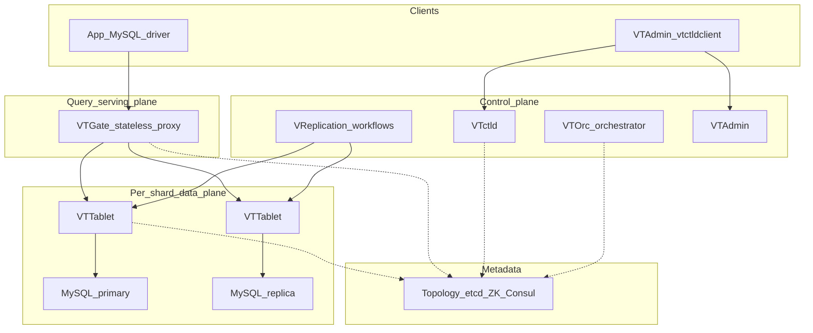
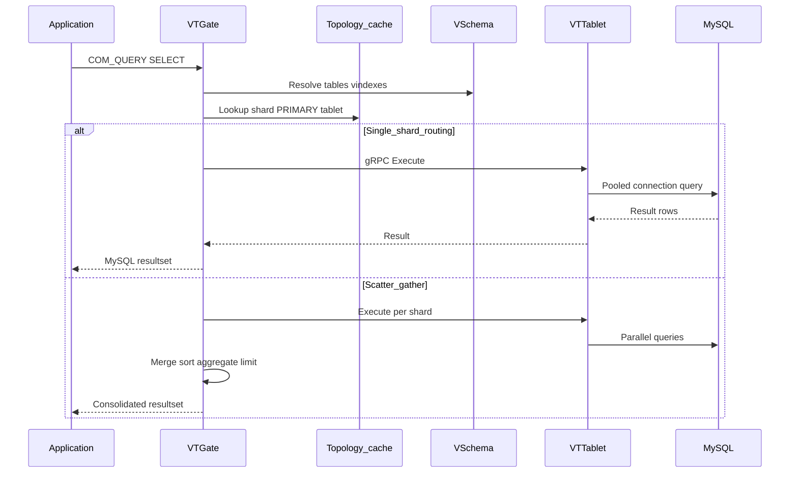
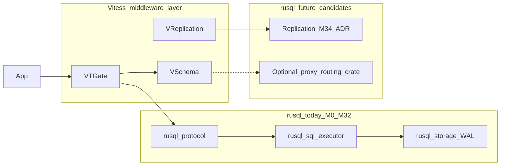

# Vitess 产品规格说明

**状态：** 参考文档  
**受众：** 平台工程师、DBA、应用开发者，以及规划 rusql 长期架构的 AI Agent  
**主要来源：** [Vitess v24（稳定版）](https://vitess.io/docs/24.0/)、[Vitess v25（开发版）](https://vitess.io/docs/25.0/)、[v23 发布说明](https://github.com/vitessio/vitess/releases/tag/v23.0.0)

英文 canonical 版本：[docs/en/references/vitess-product-spec.md](../../en/references/vitess-product-spec.md)

---

## 第一部分 — 执行摘要

### 愿景

**Vitess** 是一款开源 **MySQL 集群中间件**，让应用将多台 MySQL 实例视为一个逻辑数据库。它保留 MySQL 作为存储引擎，并增加代理层、分片控制面与运维自动化。Vitess **不是** 替代数据库引擎的产品，而是让 MySQL 水平扩展并经受生产故障的基础设施。

Vitess 诞生于 2010 年 YouTube，曾承载 YouTube 全部数据库流量五年以上，2019 年 11 月从 CNCF 毕业，Slack、Square、京东等组织在生产环境使用。

### Vitess 解决的三大问题

| 问题 | Vitess 方案 |
|------|-------------|
| **单机无法继续扩展** | 水平分片、连接池、读副本路由 |
| **运维大量 MySQL 实例** | 拓扑服务、自动故障转移（VTOrc）、备份、重分片工作流 |
| **保护数据库** | 查询重写、拦截、终止、ACL、限流、OLTP 工作负载限制 |

### 主要角色

| 角色 | 目标 | 与 Vitess 的交互 |
|------|------|------------------|
| **应用开发者** | 使用熟悉的 MySQL 驱动与 SQL | 连接 VTGate；按分片键设计 schema |
| **DBA / 平台工程师** | 安全地运维大规模集群 | 配置 VSchema、执行 MoveTables/reshard、管理 Online DDL |
| **SRE** | 在故障与增长中满足 SLO | 监控 VTGate/VTTablet、调优故障转移、管理 cell 与容量 |

### 何时选择 Vitess

在以下情况选择 Vitess：

- 拥有（或将拥有）**大规模 MySQL 资产**，希望保留 MySQL 工具链、备份习惯与 DBA 技能。
- 扩展压力主要来自**跨分片划分工作负载**，而非单一系统中的原生分布式 ACID 或 HTAP。
- 团队能投入 **VSchema 设计、vindex 与重分片工作流**。
- 接受 **单分片事务局部性** 为默认最佳路径。

继续使用 vanilla MySQL 当：

- 单机（加读副本）在可预见未来内满足容量。
- 团队无法承担控制面运维复杂度。

考虑分布式 SQL（如 TiDB、CockroachDB）当：

- 需要**自动分片**、强**跨分片分布式事务**，或集成分析能力且不愿单独运维中间件层。

### 产品定位

```
应用  →  VTGate（MySQL 协议 + gRPC）  →  VTTablet  →  MySQL / Percona
              ↑
         VSchema + 拓扑（etcd）
              ↑
    控制面（VReplication、VTOrc、VTctld、VTAdmin）
```

Vitess 在 MySQL 之上增加第二层系统。代价是运维表面积，换取无需在应用中重写分片逻辑的水平扩展能力。

---

## 第二部分 — 产品需求文档（PRD）

### B.1 问题与背景

YouTube 的扩展路径体现 Vitess 起源：

1. **读写分离** — 主库写、从库读；从库很快过载。
2. **增加副本** — 临时缓解；写压力仍在主库。
3. **应用内分片** — 分片选择逻辑嵌入应用代码。
4. **Vitess 代理** — 路由与集群管理从应用中剥离。

| 瓶颈 | 症状 | Vitess 缓解 |
|------|------|-------------|
| 连接数 | 每连接 256KB–3MB RAM + CPU | VTGate 轻量连接 + VTTablet 连接池 |
| 读吞吐 | 单从库无法承载全部读 | REPLICA / RDONLY tablet 路由、多 cell 副本 |
| 写 / 数据量 | 主库或磁盘瓶颈 | 分片、约 250GB/实例理念、重分片 |

### B.2 目标与非目标

#### 目标

- 向应用提供**统一 MySQL 兼容接口**（线协议 + 可选 gRPC 驱动）。
- **水平分片**且无需应用侧分片路由代码。
- **自动化**故障转移、备份、拓扑变更、低停机重分片。
- **保护**生产环境免受昂贵查询与连接风暴。
- 支持**多 cell**（多 AZ / 多区域）拓扑。
- 以 **MySQL 8.0 与 8.4**（含 Percona）为存储后端。

#### 非目标

- 替代 MySQL 存储引擎。
- 提供 **active-active 多主**复制。
- 在无性能代价下保证**强跨分片 ACID**（2PC 可选且昂贵）。
- 在开源项目 alone 中提供全托管零运维体验（托管服务另加一层）。
- 消除**分片感知 schema 设计**需求。

### B.3 角色与用户旅程

（与英文版结构一致：未分片 → 分片、迁入现有 MySQL、在线 schema 变更、主库故障。详见英文 canonical 文档。）

### B.4 功能需求摘要

| 域 | 关键能力 |
|----|----------|
| **FR-1 VTGate** | MySQL/gRPC、解析路由、scatter-gather、查询去重与重写、会话变量 |
| **FR-2 VTTablet** | 连接池、背压限流、健康检查、备份、VReplication 参与 |
| **FR-3 VSchema** | keyspace、shard、vindex、lookup、sequences、垂直/水平分片 |
| **FR-4 一致性** | 单分片 ACID；MULTI/TWOPC 跨分片；副本延迟感知读 |
| **FR-5 高可用** | 半同步推荐、VTOrc 故障转移、替换优于修复 |
| **FR-6 Schema** | VReplication Online DDL、声明式迁移、Instant DDL |
| **FR-7 迁移** | MoveTables、Materialize、Reshard、VDiff |
| **FR-8 运维** | etcd 拓扑、vtctld、VTAdmin、cell、熔断 |
| **FR-9 安全** | 表 ACL、TLS、外部认证集成 |

完整 FR 编号表见[英文版](../../en/references/vitess-product-spec.md#b4-functional-requirements)。

### B.5 非功能需求

| ID | 需求 | 说明 |
|----|------|------|
| NFR-1 | VTGate 水平扩展（无状态） | 大集群可达数百至数千 gate |
| NFR-2 | 每 MySQL 实例约 **250GB** 分片规模目标 | 小实例简化运维；单机多实例可接受 |
| NFR-3 | 多 cell 容错 | 单 cell 失效不导致全集群不可用 |
| NFR-4 | 故障转移秒级（VTOrc） | 半同步降低丢数据风险 |
| NFR-5 | 重分片秒级只读窗口 | 非零停机 |
| NFR-6 | 经 VTGate 的核心 OLTP SQL 兼容 | 见兼容性矩阵 |
| NFR-7 | 可观测性 | 指标、vtexplain、查询日志 |

### B.6 架构

#### 组件拓扑



#### 请求路径（OLTP SELECT）



#### 核心概念

| 概念 | 定义 |
|------|------|
| **Keyspace** | 逻辑库命名空间；可分片或未分片 |
| **Shard** | 分片 keyspace 的水平分区；拥有 key range |
| **Tablet** | `mysqld` + `vttablet`；类型含 PRIMARY、REPLICA、RDONLY 等 |
| **Cell** | 同一故障域内的服务器组（通常一个 AZ） |
| **VSchema** | 描述 vindex、sequences 与路由的 schema |
| **VReplication** | 基于 binlog 的变更流（MoveTables、Materialize、Reshard、Online DDL） |

### B.7 MySQL 兼容性矩阵

经 **VTGate** 的行为（非直连 MySQL）。版本：**v23**、**v24**、**v25**。

| 特性 | 状态 | 说明 |
|------|------|------|
| 标准 DML | **支持** | 分片表按 vindex 路由 |
| SELECT / JOIN / 子查询 | **支持** | 跨分片 JOIN 昂贵 |
| CTE（含 `WITH RECURSIVE`） | **支持** | 递归 CTE v23+ |
| 窗口函数 | **支持** | v21+ |
| 单分片事务 | **支持** | 完整 ACID |
| 跨分片事务 | **受限** | MULTI 或 TWOPC |
| `SELECT ... FOR UPDATE` | **受限** | 仅单分片 |
| 外键 | **受限** | 分片 keyspace 上受限 |
| 托管 Online DDL | **支持** | 推荐路径 |
| 临时表 | **受限** | 仅未分片 keyspace |
| 存储过程 / 触发器 / 事件 | **不支持** | 不经 VTGate |
| `LOCK TABLES` / `GET_LOCK` | **不支持** | 不经 VTGate |
| 经 VTGate 的 `KILL` | **不支持** | 直连 MySQL 或依赖超时 |
| 跨分片 JOIN | **受限** | 可用但高延迟 |
| 查询限流器 | **实验性** | v23+ |

**存储后端：** v24 为支持 MySQL 8.0 的最后版本；v25 默认 **8.4**。

### B.8 运维模型

| Tablet 类型 | 角色 |
|-------------|------|
| PRIMARY | 接受写入 |
| REPLICA | 异步副本；OLTP 读 |
| RDONLY | 批处理 / OLAP 读 |

| 工作流 | 工具 | 停机 |
|--------|------|------|
| MoveTables | vtctldclient / VTAdmin | 近零；短暂切换 |
| Reshard | VReplication | 通常数秒只读 |
| Online DDL | vtgate / vtctldclient | 非阻塞（VReplication） |
| 紧急 reparent | VTOrc | 秒级 |

### B.9 风险与依赖

| 风险 | 缓解 |
|------|------|
| 拓扑服务故障 | VTGate 缓存；拓扑不在热路径；HA etcd |
| VSchema 设计不佳 | 跨分片查询主导；早期投入分片规范 |
| 重分片复杂度 | 可逆工作流；VDiff |
| 切换时复制延迟 | MoveTables 等待 lag |
| 运维学习曲线 | VTAdmin、托管服务（如 PlanetScale） |

### B.10 竞争格局

| 方案 | 相对 Vitess |
|------|-------------|
| Vanilla MySQL | 简单；无原生分片 |
| NoSQL | 无 SQL 事务；自定义 API |
| **Vitess** | 保留 MySQL；需分片设计与双系统运维 |
| TiDB / 分布式 SQL | 自动分片与分布式 ACID；非 MySQL 引擎 |

---

## 第三部分 — Agent 导向附录

### C.1 能力验收清单

每项可在 Vitess 集群（`vttestserver` 或预发）客观验证。

- [ ] **CAP-01：** 标准 MySQL 驱动连接 VTGate，无需 Vitess 专用客户端。
- [ ] **CAP-02：** 列出分片 keyspace 的全部 shard。
- [ ] **CAP-03：** 主 vindex 等值查询生成单分片执行计划（`vtexplain`）。
- [ ] **CAP-04：** 无 vindex 条件的分片表查询生成 scatter 计划。
- [ ] **CAP-05：** sequence 列 INSERT 自动分配全局 ID。
- [ ] **CAP-06：** 单分片事务 COMMIT 后 ACID 可见。
- [ ] **CAP-07：** MULTI 跨分片事务在失败分片回滚。
- [ ] **CAP-08：** 无 LIMIT 的 OLTP 查询被重写或拒绝。
- [ ] **CAP-09：** 表 ACL 拒绝未授权用户 SELECT。
- [ ] **CAP-10：** VTGate 承载 1000+ 轻量连接而 MySQL 连接数远小于 1000。
- [ ] **CAP-11：** MoveTables 至 SwitchTraffic 且 VDiff 零差异。
- [ ] **CAP-12：** 托管 Online DDL 在全表复制期间不阻塞主库写。
- [ ] **CAP-13：** 模拟主库故障后 60s 内 VTOrc 完成 reparent 且可写。
- [ ] **CAP-14：** REPLICA 读在 lag 内返回；超阈值可配置拒绝。
- [ ] **CAP-15：** Reshard 后总行数与 VDiff 一致。
- [ ] **CAP-16：** `WITH RECURSIVE` 经 VTGate 结果正确（v23+）。
- [ ] **CAP-17：** 经 VTGate 的 `CREATE PROCEDURE` 被拒绝。
- [ ] **CAP-18：** tablet 拓扑变更在不重启 VTGate 下传播。
- [ ] **CAP-19：** `vtbackup` 可恢复且副本可追平。
- [ ] **CAP-20：** 跨分片 JOIN 结果正确但计划显示多分片路由。

### C.2 负面约束（不得假设）

1. 跨分片事务默认非完整 ACID（仅 TWOPC 提供分布式原子性）。
2.  standalone MySQL 合法 SQL 均可经 VTGate 执行。
3. 分片表上 MySQL `AUTO_INCREMENT` 全局唯一（需 Vitess sequences）。
4. 外键跨分片强制引用完整性。
5. 支持 active-active 多主写。
6. 每条 SQL 都查询拓扑服务（使用缓存）。
7. 重分片永远零停机（数秒只读正常）。
8. 分片 keyspace 支持临时表。
9. 经 VTGate 的 `KILL QUERY` 可终止查询。
10. Vitess 消除容量规划（仍建议约 250GB/分片）。

### C.3 验证场景

| 场景 | 要点 |
|------|------|
| **VS-01** 未分片启动 | 单 shard INSERT/SELECT COUNT |
| **VS-02** 分片路由 | hash vindex；`vtexplain` 单分片 |
| **VS-03** MoveTables 切换 | VDiff 零差异；流量切换 |
| **VS-04** 主库故障 | VTOrc reparent；写入恢复 |
| **VS-05** Online DDL | 并发写不长时间阻塞 |
| **VS-06** MULTI 跨分片失败 | 无部分提交 |

### C.4 开放问题与版本漂移

| 主题 | 状态 |
|------|------|
| MySQL 8.0 支持结束 | v24 最后支持；v25 面向 8.4+ |
| Query Throttler | v23+ 实验性 |
| MySQL 9.x LTS | v25+ 计划跟进 |

---

## 第四部分 — rusql 长期影响

本节将 Vitess 能力映射至 [rusql 架构](../../en/architecture/overview.md) 与 [复制 ADR](../../en/specs/adr-replication.md)。**不**授权立即实现。

### D.1 层次映射

rusql 今日实现 Vitess 用 VTTablet 包装的 **MySQL 引擎层**。VTGate、VSchema 与控制面位于 rusql 协议/服务栈**之上**。



### D.2 组件立场

| Vitess 组件 | rusql 关联 | 建议立场 |
|-------------|------------|----------|
| **VTGate** | M30+ 兼容基线前不在范围 | 优先**集成上游 Vitess**，非重写 VTGate |
| **VSchema** | 需分布式元数据 | 推迟 |
| **VTTablet** | rusql **即** MySQL 实例 | **战略契合：** 线协议+SQL+复制达标后可作 Vitess 存储后端 |
| **VReplication** | 消费类 binlog 流 | M34+ ADR 需考虑事件格式 |
| **拓扑 etcd** | 引擎外 | 仅作 Vitess 后端时需要 |
| **VTOrc / Online DDL** | 集群编排 | 不自建；用 Vitess 控制面 |

### D.3 rusql 分阶段路线

| 阶段 | 范围 | 与 Vitess 关系 |
|------|------|----------------|
| **阶段 1（当前）** | 单节点 MySQL 8.0 线协议 + SQL 子集（M0–M32+） | 无；建立引擎可信度 |
| **阶段 2** | 持久复制流（M34+ ADR） | 支持 VReplication 类变更捕获 |
| **阶段 3** | 多实例读副本 | rusql 实例可纳入 Vitess 复制图 |
| **阶段 4（可选）** | 分片代理或 Vitess 集成 | 评估 rusql 置于 VTTablet 后 vs 自建 `rusql-proxy` |
| **近期明确非目标** | 完整 VReplication、VTOrc、etcd 拓扑 | 过大；**集成而非复现** |

### D.4 rusql 非目标（Vitess 启发）

- 在 Rust 中为 MVP 集群重写 VTGate、VSchema 或拓扑服务。
- 在 MySQL 8.0 客户端兼容被验证前承诺 Vitess 兼容。
- 追求 active-active 多主（与 Vitess 哲学一致）。
- 以分布式特性阻塞单节点路线图。

### D.5 未来 ADR 触发条件

1. **M34 复制**落地 — 决定 binlog vs WAL 对外暴露（Vitess、CDC）。
2. **首个多实例里程碑** — 决定 rusql 作 Vitess 后端 vs 独立集群。
3. **兼容阈值达成**（M30+ 稳定）— 评估 Vitess 集成测试矩阵。

---

## 参考资料

| 资源 | URL |
|------|-----|
| What Is Vitess | https://vitess.io/docs/25.0/overview/whatisvitess/ |
| VSchema 指南 | https://vitess.io/docs/25.0/user-guides/vschema-guide/ |
| Schema 变更 | https://vitess.io/docs/25.0/user-guides/schema-changes/ |
| rusql MySQL 兼容路线图 | [mysql-compat-roadmap.md](../specs/mysql-compat-roadmap.md) |
| rusql 复制 ADR | [adr-replication.md](../specs/adr-replication.md) |
| 英文完整规格 | [vitess-product-spec.md](../../en/references/vitess-product-spec.md) |

---

## 文档历史

| 日期 | 变更 |
|------|------|
| 2026-07-07 | 初版参考规格（第一部分至第四部分），供 rusql 架构规划 |
